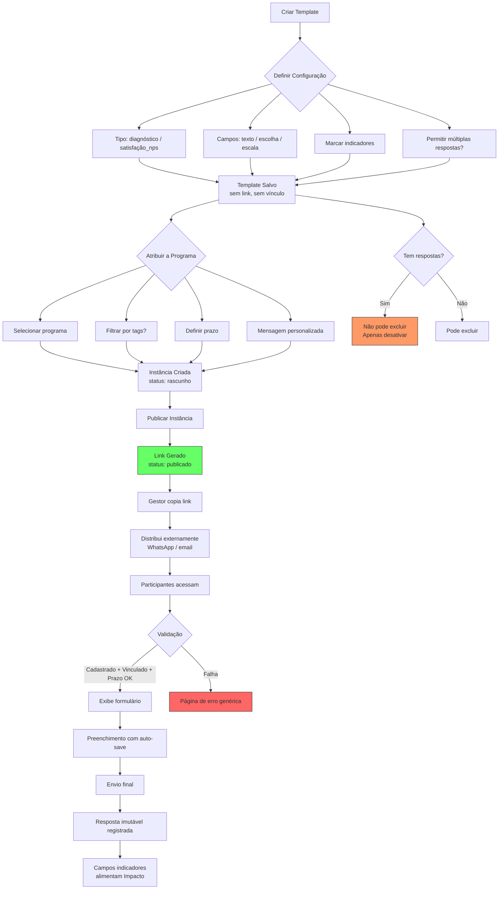
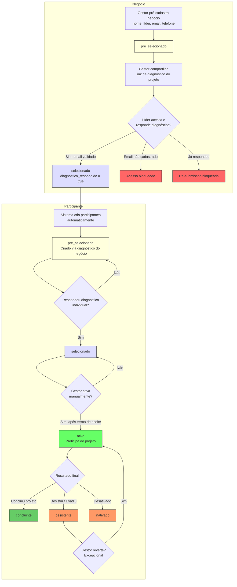
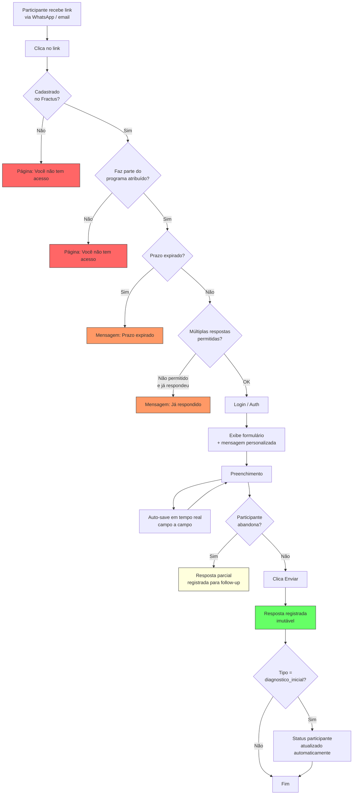
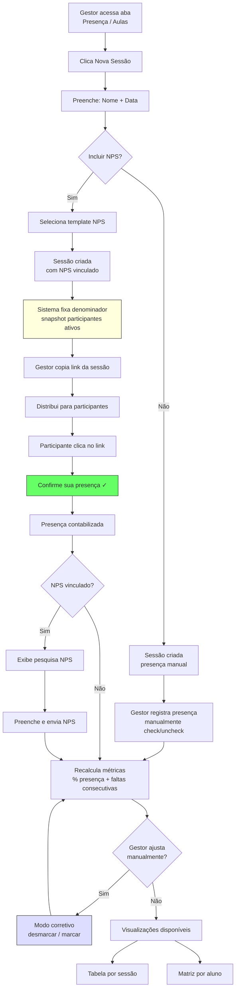
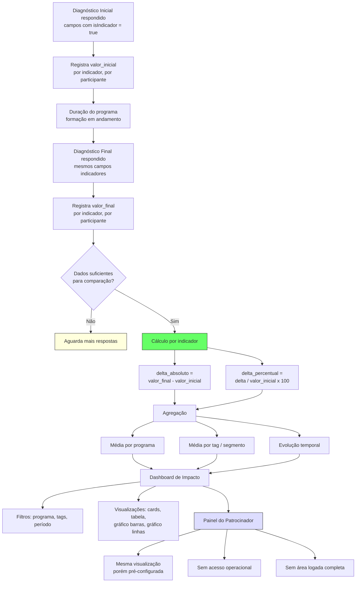
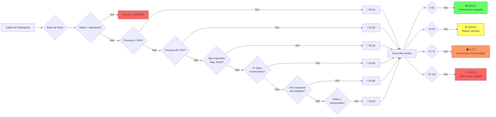

# Fractus — Regras de Negócio

> Extraído de: Transcrição Kick-Off (10/03/2026), PRD Fractus (26-27/02/2026), PRD Resumo (02/04/2026), Figma Make v1.0.1 e v1.0.2
>
> **Atualizado em 03/04/2026** — Alinhado com PRD Resumo (02/04/2026) e Figma Make v1.0.2. Mudanças principais: Negócio como entidade primária do MVP, nomenclatura atualizada (Projetos, Investidores, Pesquisas), fluxo de diagnóstico com página pública.

---

## Sumário

- [1. Templates & Pesquisas](#1-templates--pesquisas)
- [2. Atribuição & Instâncias](#2-atribuicao--instancias)
- [3. Respostas](#3-respostas)
- [4. Participantes](#4-participantes)
- [5. Presença & Sessões](#5-presenca--sessoes)
- [6. Negócios](#6-negocios)
- [7. Diagnóstico](#7-diagnostico)
- [8. Investidores](#8-investidores)
- [9. Impacto & Indicadores](#9-impacto--indicadores)
- [10. Autenticação & Acesso](#10-autenticacao--acesso)
- [11. Projetos](#11-projetos)
- [12. Navegação & UX](#12-navegacao--ux)
- [13. Escopo MVP vs V2](#13-escopo-mvp-vs-v2)
- [Fluxogramas](#fluxogramas)

---

## Legenda de Fontes

| Código | Fonte |
|--------|-------|
| **[T]** | Transcrição Kick-Off (10/03/2026) |
| **[P1]** | PRD 26.02.2026 |
| **[P2]** | PRD 27.02.2026 |
| **[P3]** | Resumo 03.03.2026 |
| **[P4]** | Resumo 12.03.2026 |
| **[TY]** | types.ts (Figma Make v1.0.1) |
| **[FM2]** | Figma Make v1.0.2 |
| **[PRD4]** | PRD Resumo (02/04/2026) |

---

## 1. Templates & Pesquisas

| ID | Regra | Fonte |
|----|-------|-------|
| BR-TPL-001 | Templates são modelos reutilizáveis de formulários, não vinculados a nenhum programa até serem atribuídos | [P1] Seção "Templates e Atribuições" |
| BR-TPL-002 | Templates são organizados em Workspaces. Cada template pertence a um Workspace | [P1] 9.3; [P2] 9 |
| BR-TPL-003 | Tipos de template: `diagnostico_inicial`, `diagnostico_meio`, `diagnostico_final`, `satisfacao_nps` | [P1] 9.4; [TY] |
| BR-TPL-004 | Tipos de campo: `texto`, `escolha_unica`, `multipla_escolha`, `escala` | [TY] TipoCampo |
| BR-TPL-005 | Cada template define: nome, tipo, workspace, campos, obrigatoriedade, e permissão para múltiplas respostas | [P1] 9.5 |
| BR-TPL-006 | Campos podem ser marcados como indicador (`isIndicador`) com nome (`nomeIndicador`) para uso no módulo de impacto | [TY]; [T] 08:22 |
| BR-TPL-007 | Campos de escala possuem `escalaMin`, `escalaMax`, `escalaLabelMin`, `escalaLabelMax` | [TY] CampoTemplate |
| BR-TPL-008 | Template pode ser duplicado. Duplicação nasce como cópia editável | [T] 22:15 |
| BR-TPL-009 | Template com respostas NÃO pode ser excluído — apenas desativado | [T] 22:58 |
| BR-TPL-010 | Template desativado/despublicado faz o link parar de funcionar; exibe tela específica | [T] 12:40 |
| BR-TPL-011 | Template é internamente tagueado pelo tipo para cálculo no módulo de impacto | [P1] 9.5 |
| BR-TPL-012 | Link do formulário só existe após atribuição a um programa; não existe no template isolado | [T] 12:45; [P3] 1 |
| BR-TPL-013 | Templates fazem parte da navegação global (menu principal) | [P1] 2; [P2] 2 |
| BR-TPL-014 | Edição de template bloqueada após vinculação a sessão | [P3] |
| BR-TPL-015 | Workspaces organizam templates por programa/patrocinador e garantem governança | [P1] 9.3 |
| BR-TPL-016 | Tabela de templates exibe: nome, tipo, fase, n perguntas, n respostas, status publicado/não | [T] 12:10 |

---

## 2. Atribuição & Instâncias

| ID | Regra | Fonte |
|----|-------|-------|
| BR-ATR-001 | Atribuição = template aplicado a programa (com filtro opcional por tags). Cria uma instância vinculada | [P1] "Templates e Atribuições"; [P2] 6 |
| BR-ATR-002 | Link gerado NÃO é disparado automaticamente; distribuição é externa (WhatsApp, e-mail) | [P1] 9.6; [T] 32:03 |
| BR-ATR-003 | Quando múltiplas tags são selecionadas, o sistema cria instância separada por segmento | [P1] 4.3, 6.2 |
| BR-ATR-004 | Cada instância possui: tipo, programa, segmento, data, prazo, status, link, respostas X/Y | [P1] 6.3; [P2] 6 |
| BR-ATR-005 | Y (total esperado) é calculado com base nos participantes ativos do programa/segmento | [P1] 6.3 |
| BR-ATR-006 | Status de instância: `rascunho`, `publicado`, `expirado` | [TY] StatusInstancia |
| BR-ATR-007 | Instância pode ter mensagem personalizada (ex: "Hora de dar sua opinião") | [T] 41:06; [TY] |
| BR-ATR-008 | Instância pode ter prazo de validade. Se expirado, link exibe mensagem genérica | [P1] 9.7; [TY] |
| BR-ATR-009 | Instância guarda cópia do tipo do template para facilitar queries | [TY] Instância |
| BR-ATR-010 | Instância pode filtrar participantes por tags (`tagsFiltro`) | [TY]; [P2] 6 |
| BR-ATR-011 | Modelo de atribuição controlado: formulários circulam exclusivamente por atribuição formal | [P3] 1 |
| BR-ATR-012 | Links podem ter rastreamento para saber quantas pessoas abriram | [T] 32:29 |

---

## 3. Respostas

| ID | Regra | Fonte |
|----|-------|-------|
| BR-RSP-001 | Salvamento automático (auto-save) durante preenchimento | [P1] 9.8; [T] 10:11 |
| BR-RSP-002 | Após envio, resposta NÃO é editável (imutável) | [P1] 9.8 |
| BR-RSP-003 | Cada resposta vinculada a: participanteId, instanciaId, templateId, programaId, versaoTemplate | [P1] 9.8; [TY] |
| BR-RSP-004 | Respostas parciais (abandono no meio) devem ser registradas para estratégias de follow-up | [T] 10:42 |
| BR-RSP-005 | Múltiplas respostas ao mesmo template permitidas conforme configuração (`permitirMultiplasRespostas`) | [P1] 9.7; [T] 06:19 |
| BR-RSP-006 | Diferenciação de múltiplas respostas feita pela data de atribuição | [T] 38:08 |
| BR-RSP-007 | Se múltiplas respostas não permitidas, participante bloqueado de responder novamente | [P1] 9.7 |
| BR-RSP-008 | Resposta registra `dataEnvio` e `completedAt` | [TY] RespostaInstancia |
| BR-RSP-009 | Resposta registra `versaoTemplate` para rastreabilidade | [TY] |
| BR-RSP-010 | Respostas individuais visualizáveis via modal (por participante, por pergunta) | [T] 18:50 |

---

## 4. Participantes

| ID | Regra | Fonte |
|----|-------|-------|
| BR-PRT-001 | Status possíveis: `pre_selecionado`, `selecionado`, `ativo`, `inativado`, `desistente`, `concluinte` | [PRD4]; [FM2] |
| BR-PRT-002 | Participante criado automaticamente via diagnóstico do negócio, com status `pre_selecionado` | [PRD4] 5.4; [FM2] |
| BR-PRT-003 | Transição `pre_selecionado` → `selecionado` automática ao responder diagnóstico individual | [PRD4] 5.5 |
| BR-PRT-004 | Transição para `ativo` requer ativação manual pelo gestor (após termo de aceite externo) | [PRD4] 5.6; [FM2] |
| BR-PRT-005 | Participante que não responde no prazo pode ser manualmente alterado pelo gestor | [T] 32:48 |
| BR-PRT-006 | Participante pode estar vinculado a múltiplos projetos | [P1] 4.5 |
| BR-PRT-007 | Participante pertence a exatamente 1 negócio (`negocio_id` FK obrigatória) | [PRD4] 7; [FM2] |
| BR-PRT-008 | Tags para segmentação flexível: turma, negócio, grupo, cohort, outro | [TY]; [P2] 4.2 |
| BR-PRT-009 | Campos obrigatórios: nome, email, telefone, cpf, data nascimento. Opcionais: gênero, endereço completo (cep, endereço, número, complemento, bairro, cidade, estado), cargo | [FM2] |
| BR-PRT-010 | Indicadores operacionais exibidos: % presença, faltas consecutivas, status | [P2] 4.4; [TY] |
| BR-PRT-011 | Campo booleano `respondeuDiagnosticoInicial` | [TY] |
| BR-PRT-012 | Campo `dataVinculo` indica quando foi vinculado ao programa | [TY] |
| BR-PRT-013 | Detalhes permitem edição inline. Indicação de "dados pendentes" vs "completos" | [T] 33:44; [P3] 5 |
| BR-PRT-014 | Importação no MVP via backend (CSV); em V2 via planilha pelo front | [T] 27:31 |
| BR-PRT-015 | Inscrições NÃO feitas pelo Fractus no MVP; vem de plataforma externa | [T] 25:49 |
| BR-PRT-016 | Página detalhada individual pode ficar para V2 | [P3] |
| BR-PRT-017 | Tabela de participantes deve exibir nome do negócio e botão WhatsApp | [P3] |
| BR-PRT-018 | Edição de célula na tabela permissionada apenas para gestor | [P3] 5 |

---

## 5. Presença & Sessões

| ID | Regra | Fonte |
|----|-------|-------|
| BR-PRS-001 | Presença organizada por Sessões. Cada sessão é uma fotografia do momento | [P2] 8.1; [P1] 8 |
| BR-PRS-002 | Sessão possui: nome, data, programa, base esperada (snapshot), n presentes, % presença | [P2] 8.1; [TY] |
| BR-PRS-003 | Denominador fixado no momento da criação da sessão (snapshot de participantes esperados) | [P2] 3; [TY] `denominador` |
| BR-PRS-004 | Modo padrão: presença = quem respondeu ao link de confirmação | [P3] 3; [T] 37:17 |
| BR-PRS-005 | Link único: presença + NPS opcional na mesma tela. Se ativado, NPS aparece após confirmar presença | [P3] 3; [T] 38:10 |
| BR-PRS-006 | Modo corretivo manual: facilitador pode ajustar presença. É corretivo, não substitutivo | [P2] 4b; [P1] 8.1 |
| BR-PRS-007 | Sessão pode ter instância de satisfação vinculada (`instanciaSatisfacaoId`) | [TY] Sessão |
| BR-PRS-008 | Tipo de sessão: `manual` ou `inferida` (registrada manualmente ou inferida via NPS) | [TY] |
| BR-PRS-009 | Sessões podem ser filtradas por tags (`tagsFiltro`) | [TY] |
| BR-PRS-010 | Presença mostra lista completa de participantes (respondeu + não respondeu) | [P3] |
| BR-PRS-011 | Remover coluna de respondentes quando vinculado a NPS (já mostra X/Y) | [P3] |
| BR-PRS-012 | Modelo novo de presenças: `Record<participanteId, boolean>` | [TY] |
| BR-PRS-013 | Corrigir inconsistências no cálculo de presença (base deve mostrar total, não zero) | [P3] |
| BR-PRS-014 | Duas visualizações: tabela por sessão e matriz por aluno | [T] 39:33 |
| BR-PRS-015 | Matriz por aluno mostra % individual e marca falta por módulo | [T] 39:45 |
| BR-PRS-016 | Edição de sessão limitada a nome e data | [T] 37:08 |
| BR-PRS-017 | No MVP, sem geolocalização, QR code ou automações complexas | [P1] 8.1 |

---

## 6. Negócios

| ID | Regra | Fonte |
|----|-------|-------|
| BR-NEG-001 | Negócio é entidade primária do MVP — porta de entrada no sistema. Possui CRUD completo com drawer de 2 abas (Cadastro + Pesquisas) | [PRD4] 4; [FM2] |
| BR-NEG-002 | Negócio é pré-cadastrado manualmente pelo gestor na aba Negócios do projeto. Campos: nome do negócio, nome do líder, e-mail do líder, telefone | [PRD4] 5.2; [FM2] |
| BR-NEG-003 | Cada negócio pertence a exatamente 1 projeto (`projeto_id` FK obrigatória) | [PRD4]; [FM2] |
| BR-NEG-004 | Status possíveis: `pre_selecionado` (padrão ao criar), `selecionado` (após diagnóstico respondido) | [PRD4] 6.1; [FM2] |
| BR-NEG-005 | Transição `pre_selecionado` → `selecionado` automática quando diagnóstico do negócio é respondido | [PRD4] 5.3 |
| BR-NEG-006 | Diagnóstico do negócio só pode ser respondido 1 vez (`diagnostico_respondido = true` bloqueia resubmissão) | [FM2] DiagnosticoPage |
| BR-NEG-007 | Participante não pode existir sem negócio associado (`negocio_id` FK obrigatória) | [PRD4] 7 |
| BR-NEG-008 | Aba Negócios exibe tabela com: nome, líder, status, diagnóstico (respondido/pendente), nº membros, ações | [PRD4] 9; [FM2] |
| BR-NEG-009 | Drawer de negócio tem 2 abas: Cadastro (dados editáveis + dados diagnóstico read-only) e Pesquisas (histórico de pesquisas respondidas) | [PRD4] 9; [FM2] |
| BR-NEG-010 | Ações disponíveis na tabela: novo negócio, visualizar detalhes, editar, copiar link de diagnóstico | [PRD4] 9 |
| BR-NEG-011 | Após envio do diagnóstico, sistema cria automaticamente os participantes vinculados ao negócio com status `pre_selecionado` | [PRD4] 5.4 |
| BR-NEG-012 | E-mail do líder deve estar pré-cadastrado para que o negócio possa responder o diagnóstico | [PRD4] 7; [FM2] |

---

## 7. Diagnóstico

| ID | Regra | Fonte |
|----|-------|-------|
| BR-DIG-001 | Cada projeto possui 1 link único de diagnóstico (`/diagnostico/:projetoId`). Não é personalizado por negócio | [PRD4] 5.3; [FM2] |
| BR-DIG-002 | Link de diagnóstico aparece na página geral da aba Negócios (botão "Copiar link de diagnóstico"), não dentro do drawer | [FM2] fractus-ajustes |
| BR-DIG-003 | Acesso ao diagnóstico requer validação de e-mail: apenas e-mails pré-cadastrados no negócio podem responder | [PRD4] 7; [FM2] |
| BR-DIG-004 | Diagnóstico do negócio é um formulário de 3 páginas: P1 (faturamento, funcionários, área), P2 (tempo mercado, digitalização, desafio), P3 (expectativa, conhece programas) + lista de membros (nome, email, cargo) | [FM2] DiagnosticoPage |
| BR-DIG-005 | Após envio do diagnóstico: status do negócio muda para `selecionado`, participantes são criados automaticamente | [PRD4] 5.3-5.4 |
| BR-DIG-006 | Re-submissão do diagnóstico é bloqueada — se `diagnostico_respondido = true`, exibe erro | [FM2] DiagnosticoPage |
| BR-DIG-007 | Diagnóstico individual do participante: participante com status `pre_selecionado` responde pesquisa diagnóstica → status muda para `selecionado` | [PRD4] 5.5 |
| BR-DIG-008 | Dados do diagnóstico respondido aparecem no drawer do negócio/participante como read-only (nunca vazios após resposta) | [FM2] fractus-ajustes |

---

## 8. Investidores

| ID | Regra | Fonte |
|----|-------|-------|
| BR-INV-001 | Investidores (antes: Patrocinadores) na navegação global (menu principal) | [PRD4] 3; [FM2] |
| BR-INV-002 | Investidor deve existir ANTES de criar projeto que o referencia | [T] 24:10 |
| BR-INV-003 | Criação simples: nome obrigatório, descrição opcional | [FM2] NovoInvestidorDrawer |
| BR-INV-004 | Detalhe abre em drawer (não página nova) com dados editáveis e projetos vinculados | [T] 24:30; [FM2] |
| BR-INV-005 | No MVP, investidor NÃO possui acesso operacional; é apenas entidade de associação | [P1] 4.6 |
| BR-INV-006 | Terá painel de visualização (impacto) sem área logada operacional | [T] 44:17 |
| BR-INV-007 | Investidor pode estar vinculado a um ou mais projetos | [P1] 4.6; [FM2] |
| BR-INV-008 | Seleção de investidor no projeto via autocomplete multi-select com tag chips | [FM2] NovoProgramaDrawer |

---

## 9. Impacto & Indicadores

| ID | Regra | Fonte |
|----|-------|-------|
| BR-IMP-001 | Comparação principal: Diagnóstico Inicial vs Diagnóstico Final | [P1] 10.1; [P2] 10 |
| BR-IMP-002 | Cálculo ocorre apenas com dados comparativos suficientes | [P1] 10.2 |
| BR-IMP-003 | Exibição por indicador: valor inicial, valor final, delta absoluto, delta percentual | [P1] 10.4; [TY] |
| BR-IMP-004 | Dashboard permite: comparação inicial vs final, média por turma/tag, evolução, filtros | [P1] 10.5; [P2] 10 |
| BR-IMP-005 | Sem relatório narrativo automatizado no MVP | [P1] 10.5 |
| BR-IMP-006 | Campos marcados como indicador nos templates alimentam automaticamente o módulo | [T] 08:22 |
| BR-IMP-007 | Painéis customizados: selecionar indicadores, filtrar por programa/tags, escolher visualização | [TY] PainelCustomizado |
| BR-IMP-008 | Indicadores serão definidos pela equipe (Karen/Abigail); módulo depende deles | [T] 04:30 |

---

## 10. Autenticação & Acesso

| ID | Regra | Fonte |
|----|-------|-------|
| BR-AUT-001 | Login obrigatório para acessar link de formulário | [P1] 9.7 |
| BR-AUT-002 | Validação dupla: participante cadastrado no Fractus + faz parte do programa do link | [P1] 9.7; [T] 42:28 |
| BR-AUT-003 | Prazo expirado exibe mensagem genérica | [P1] 9.7 |
| BR-AUT-004 | Se múltiplas respostas não permitidas e já respondeu, bloqueia | [P1] 9.7 |
| BR-AUT-005 | Dois tipos de usuário: `gestor` e `participante` | [TY] Usuario |
| BR-AUT-006 | No MVP, participante NÃO possui área própria. Recebe link, loga, responde, envia | [P1] 11; [P2] 11 |
| BR-AUT-007 | Validação de elegibilidade via parâmetros de atribuição (não aberta a qualquer autenticado) | [P3] 2 |

---

## 11. Projetos

| ID | Regra | Fonte |
|----|-------|-------|
| BR-PRJ-001 | Projeto (antes: Programa) é a unidade organizacional principal. Contém negócios, participantes, aulas, pesquisas | [PRD4] 4; [FM2] |
| BR-PRJ-002 | Campos obrigatórios: nome, data início, data fim, vagas, modalidade (Presencial/Online/Híbrido). Opcionais: descrição, inscritos, carga horária, investidores | [FM2] NovoProgramaDrawer |
| BR-PRJ-003 | Total de inscritos pode existir sem que todos estejam cadastrados como participantes | [P1] 4.3 |
| BR-PRJ-004 | Projeto possui quantidade de vagas (`vagas`) | [FM2]; [T] 26:36 |
| BR-PRJ-005 | Abas do projeto: Negócios, Participantes, Aulas, Pesquisas | [PRD4] 8; [FM2] |
| BR-PRJ-006 | No nível de Projeto, criar diagnósticos/pesquisas para múltiplos segmentos (tags) | [P1] 4.3 |
| BR-PRJ-007 | Turmas removidas como entidade estrutural no MVP. Tags substituem turmas | [P2] 1 |
| BR-PRJ-008 | Projetos fazem parte da navegação global (sidebar: Gestão > Projetos) | [FM2] Sidebar |
| BR-PRJ-009 | Edição permite alterar: nome, descrição, datas, vagas, carga horária, modalidade, investidores | [FM2] |
| BR-PRJ-010 | Tabela de projetos exibe: nome/projeto, período, presença, investidores, ações | [FM2] GestaoPage |

---

## 12. Navegação & UX

| ID | Regra | Fonte |
|----|-------|-------|
| BR-UX-001 | Sidebar: Gestão (Projetos, Investidores), Templates (Formulários), Impacto (Resultados). Dentro do projeto: Negócios, Participantes, Aulas, Pesquisas | [PRD4] 8; [FM2] Sidebar |
| BR-UX-002 | Detalhes simples (patrocinador) abrem em drawer lateral, não em página nova | [T] 24:30 |
| BR-UX-003 | Páginas devem ter: busca, filtro, e métricas de destaque no topo (colapsáveis) | [T] 14:45 |
| BR-UX-004 | Métricas no topo podem ser ocultadas/colapsadas (fold/unfold) | [T] 15:30, 20:33 |
| BR-UX-005 | Paginação em tabelas com botões desabilitados em cinza (não branco) | [T] 15:54 |
| BR-UX-006 | Tabelas suportam ordenação por colunas | [P2] 5 |
| BR-UX-007 | Nomes longos truncados com "..." e texto completo no hover | [T] 39:56 |
| BR-UX-008 | Breadcrumbs e botão de voltar em páginas secundárias/terciárias | [T] 17:35 |
| BR-UX-009 | Permitir salvar e reaplicar visualizações de filtros frequentes | [T] 16:44 |
| BR-UX-010 | Considerar submenus no menu lateral para reduzir profundidade de navegação | [T] 46:05 |

---

## 13. Escopo MVP vs V2

| ID | Regra | Fonte |
|----|-------|-------|
| BR-MVP-001 | No MVP, sem disparo automático de links/notificações | [P1] 9.6 |
| BR-MVP-002 | Status de participante: transições automáticas (pré-sel→selecionado via diagnóstico) e manuais (selecionado→ativo pelo gestor) | [PRD4] 7 |
| BR-MVP-003 | V2: regras automatizadas de evasão (faltas consecutivas, alertas preventivos) | [P2] 12.2 |
| BR-MVP-004 | V2: automação de disparo (NPS automático, lembretes) | [P2] 12.4 |
| BR-MVP-005 | ~~V2: entidade estrutural de Negócio~~ — **Antecipado para MVP** (PRD 02/04/2026). Negócio já é entidade primária com CRUD completo e diagnóstico | [PRD4]; [FM2] |
| BR-MVP-006 | V2: inscrição pela própria plataforma Fractus | [T] 30:42 |
| BR-MVP-007 | V2: importação de participantes via planilha pelo front-end | [T] 27:31 |
| BR-MVP-008 | V2: versionamento avançado de templates e comparação multi-momento | [P2] Tabela |
| BR-MVP-009 | Backlog: geolocalização, QR Code, integração com LMS | [P2] Tabela |
| BR-MVP-010 | Backlog: relatório narrativo automatizado com insights | [P2] Tabela |

---

## Fluxogramas

### Fluxo 1 — Ciclo de Vida do Template

### Fluxo 2 — Fluxo Completo: Negócio → Participante → Ativação

### Fluxo 3 — Resposta ao Formulário

### Fluxo 4 — Sessão e Presença

### Fluxo 5 — Cálculo de Impacto

### Fluxo 6 — Motor de Risco de Evasão

---

## Estatísticas

| Categoria | Quantidade |
|-----------|-----------|
| Templates & Pesquisas | 16 regras |
| Atribuição & Instâncias | 12 regras |
| Respostas | 10 regras |
| Participantes | 18 regras |
| Presença & Sessões | 17 regras |
| Negócios | 12 regras |
| Diagnóstico | 8 regras |
| Investidores | 8 regras |
| Impacto & Indicadores | 8 regras |
| Autenticação & Acesso | 7 regras |
| Projetos | 10 regras |
| Navegação & UX | 10 regras |
| Escopo MVP vs V2 | 10 regras |
| **Total** | **146 regras** |
| **Fluxogramas** | **6 diagramas Mermaid** |
