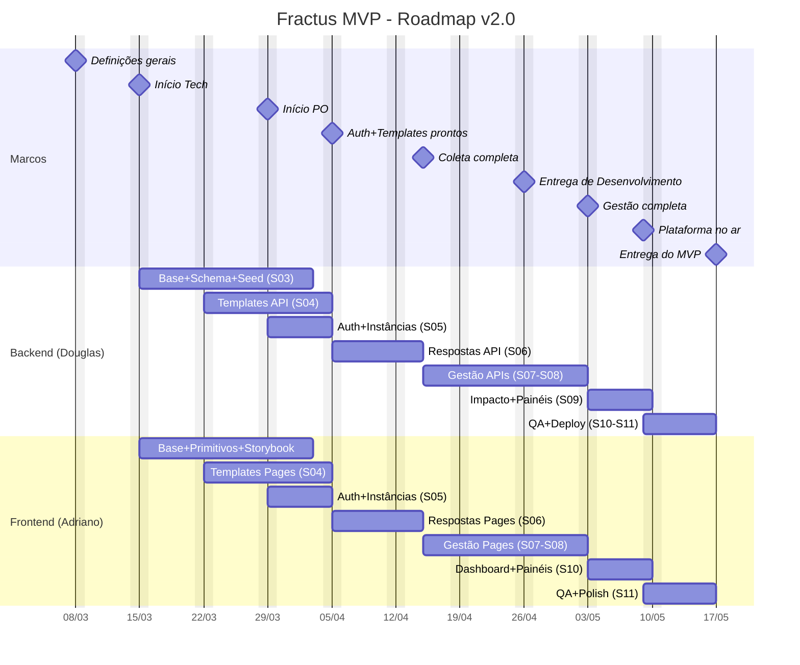

# Fractus — Roadmap Macro (Timeline Geral)

> **Versão:** 2.0 (adaptada para dev junior)
> **Data de referência:** 18/03/2026 (Início Tech)
> **Entrega MVP:** 17/05/2026
> **Stack:** Next.js App Router + Supabase (Client SDK + SQL migrations) + shadcn/ui + Zod

---

## Timeline Visual

```
Março                          Abril                          Maio
|--2-----|--8-----|--15----|--22----|--29----|--5-----|--12----|--19----|--26----|--3-----|--10----|--17--|
         ◆        ◆◆               ◆        ◆        ◆                ◆        ◆    ◆            ◆
     Definições  Início           Início   Auth+    Entregas        Entrega  Gestão Plataforma  Entrega
      gerais      Tech             PO     Templates  D/P MVP          Dev   completa  no ar      MVP
                                            05/04                                     09/05
```

---

## Marcos (datas fixas)

| # | Marco | Data | O que significa para você |
|---|-------|------|--------------------------|
| 1 | Definições gerais | 08/03 | Stack, escopo e arquitetura definidos. Você não precisa fazer nada aqui |
| 2 | Início Tech | 15/03 | **Primeiro dia de código.** Scaffold do projeto, instalar dependências |
| 3 | Início PO | 29/03 | Product Owner começa a validar o que vocês entregam. A partir daqui, funcionalidades prontas são revisadas |
| 4 | Auth + Templates prontos | 05/04 | Login funciona (gestor + participante). CRUD de templates completo. Primeiro módulo "entregue" |
| 5 | Entregas D/P MVP | 12/04 | Design/Produto entregam specs de todos os módulos. Dev tem tudo para trabalhar |
| 6 | Coleta completa | 15/04 | Formulário público funciona. Participante recebe link, responde, resposta salva |
| 7 | Entrega de Desenvolvimento | 26/04 | Módulos core implementados. Foco muda para polimento |
| 8 | Gestão completa | 03/05 | Programas, participantes, presença, negócios — tudo rodando |
| 9 | Plataforma no ar | 09/05 | Deploy em produção. URL real acessível |
| 10 | Entrega MVP | 17/05 | MVP completo, testado, validado. **Deadline final** |

---

## Fases (o que se faz em cada período)

### Fase 0 — Definições (02/03 - 15/03)

**O que acontece:** Decisões de stack, análise do protótipo, cronograma no ClickUp.
**Quem faz:** Douglas + Adriano (compartilhado).
**Entregáveis:** Nenhum código. Apenas documentos e decisões.

> **Para o dev junior:** Você lê os ADRs em `docs/adr/` para entender por que cada tecnologia foi escolhida. Não precisa implementar nada nesta fase.

---

### Fase 1 — Base + Padronização (15/03 - 03/04)

**O que acontece:** Scaffold do projeto, design system configurado, schema do banco, Storybook.

| Responsável | O que faz |
|-------------|-----------|
| **Douglas (BE)** | Schema SQL completo (15 tabelas, 5 enums) via `supabase migration new`. Seed data. RLS policies. Validações Zod |
| **Adriano (FE)** | Scaffold Next.js. Configurar Tailwind com tokens do DS. Instalar 34 primitivos shadcn/ui. Criar 12 compostos customizados. Setup Storybook. Page Shells |
| **Compartilhado** | ESLint + Prettier. Vitest. `.env.local`. Supabase MCP Server. Deploy preview Vercel |

**Como saber se terminou:**
- [ ] `pnpm build` passa sem erros
- [ ] `pnpm storybook` roda com todos os compostos
- [ ] Schema deployado no Supabase com seed data
- [ ] Deploy preview no Vercel acessível

> **Referência:** [Fase 1 detalhada](../plans/fase-1-base.md)

---

### Fase 2a — Coleta: Templates (22/03 - 05/04)

**O que acontece:** CRUD de templates, workspaces, form builder.

| Responsável | O que faz |
|-------------|-----------|
| **Douglas (BE)** | API Workspaces CRUD. API Templates CRUD + versionamento. Zod schemas para todas entidades |
| **Adriano (FE)** | Compostos avançados (MultiSelect, DataTable, CsvImportWizard). 3 pages de Templates |

**Dependências:** FE depende de `T-024 (API Templates)` estar pronto para conectar as pages.

> **Enquanto espera API:** Trabalhar com mock data ou Storybook isolated.

---

### Fase 2b — Auth (29/03 - 05/04)

**O que acontece:** Login gestor (email/senha) + participante (magic link). Middleware protege rotas.

| Responsável | O que faz |
|-------------|-----------|
| **Douglas (BE)** | Supabase Auth config. Middleware Next.js. Callback route. Rate limiting |
| **Adriano (FE)** | Login page. Magic link flow. Auth guard no layout `(platform)/` |

**Marco: Auth + Templates prontos (05/04)**

> **Referência:** [Fase 2 detalhada](../plans/fase-2-coleta-auth.md) | [ADR-008: Magic link](../adr/008-magic-link-auth.md)

---

### Fase 2c — Coleta: Respostas (05/04 - 15/04)

**O que acontece:** Formulário público, auto-save, visualização de respostas.

| Responsável | O que faz |
|-------------|-----------|
| **Douglas (BE)** | API Respostas (submit + auto-save + rascunho). Auto-status (responder diagnostico_inicial → ativo). Validação de link público |
| **Adriano (FE)** | FormPublico (`/f/[linkId]`) com 4 tipos de campo. RespostasViewer com visualização por tipo |

**Marco: Coleta completa (15/04)**

---

### Fase 3a — Gestão de Programas (15/04 - 03/05)

**O que acontece:** Módulo completo — programas, participantes, negócios, patrocinadores, presença, NPS, motor de risco.

| Responsável | O que faz |
|-------------|-----------|
| **Douglas (BE)** | APIs: Programas, Participantes (+ bulk CSV), Patrocinadores, Sessões, Presença, Negócios. Motor de risco (7 fatores, 4 níveis) |
| **Adriano (FE)** | Pages: ProgramasList, ProgramaDetail (5 tabs), ParticipantesList, PatrocinadoresList, PresencaTab, NegociosTab |

**Marco: Gestão completa (03/05)**

> **Referência:** [Fase 3 detalhada](../plans/fase-3-gestao.md)

---

### Fase 3b — Impacto + Painéis (03/05 - 10/05)

**O que acontece:** Dashboard de impacto, painéis customizados, painel do patrocinador.

| Responsável | O que faz |
|-------------|-----------|
| **Douglas (BE)** | API Indicadores (média inicial vs final). API Dashboard. API Painéis CRUD |
| **Adriano (FE)** | ImpactoDashboard (Recharts). PainelEditor. Painel Patrocinador (read-only) |

> **Atenção:** Regras de negócio de Impacto podem não estar 100% definidas. Verificar com PO antes de começar.

---

### Fase 4 — QA + Deploy (09/05 - 17/05)

**O que acontece:** Testes E2E, acessibilidade, performance, deploy produção.

| Task | Responsável | Critério |
|------|-------------|----------|
| Testes E2E Playwright (5 cenários) | D + A | 5 cenários passam |
| Auditoria acessibilidade | D + A | Lighthouse Accessibility > 80 |
| Performance | D + A | FCP < 1.5s, Lighthouse > 80 |
| Bug fixing + polish | D + A | Zero bugs críticos |
| Deploy produção | Douglas | URL real acessível |

**Marco: Plataforma no ar (09/05) → Entrega MVP (17/05)**

> **Referência:** [Fase 4 detalhada](../plans/fase-4-impacto-deploy.md)

---

## Diagrama Gantt



---

## Mapeamento Upstream ↔ Downstream

| O que Produto/Design entrega | Quando | O que Dev consome | Quando |
|------------------------------|--------|-------------------|--------|
| Padronização de UI (tokens, cores, tipografia) | 08/03 - 15/03 | Base + Padronização (scaffold, Tailwind, shadcn) | 15/03 - 03/04 |
| Coleta - Templates (design) | 15/03 - 22/03 | API + Pages Templates | 22/03 - 05/04 |
| Autenticação (design) | 22/03 - 05/04 | Auth Supabase + Login page | 29/03 - 05/04 |
| Coleta - Respostas (design) | 22/03 - 05/04 | API + Pages Respostas | 05/04 - 15/04 |
| Gestão de programas (design) | 08/03 - 15/03 | APIs + Pages Gestão | 15/04 - 03/05 |
| Impacto + Painéis (design) | 05/04 - 15/04 | APIs + Dashboard | 03/05 - 10/05 |

> **Regra:** Se Produto/Design não entregou a spec, o dev **não começa a feature**. Trabalhar em outras tasks ou melhorar testes/docs.

---

## Riscos que afetam o seu trabalho

| Risco | O que fazer |
|-------|-------------|
| API não pronta quando preciso para o FE | Trabalhar com mock data no Storybook. Conectar API quando pronta |
| Regras de Impacto não definidas | Não inventar regras. Esperar spec do PO. Focar em outras tasks |
| Build quebra após merge | Rodar `pnpm build` antes de abrir PR. Nunca mergear com build quebrado |
| Novo dev entra no meio do projeto | Ler esta doc + [setup-ambiente.md](../guides/setup-ambiente.md) + ADRs. Começar por tasks menores |

---

## Referências

| Doc | O que contém |
|-----|-------------|
| [Sprint Track — Backend](track-backend.md) | Todas as tasks do Douglas, sprint por sprint |
| [Sprint Track — Frontend](track-frontend.md) | Todas as tasks do Adriano, sprint por sprint |
| [Como trabalhar com sprints](como-trabalhar.md) | Guia prático: como pegar task, desenvolver, entregar |
| [Fase 1](../plans/fase-1-base.md) | Checklist detalhado da Fase 1 |
| [Fase 2](../plans/fase-2-coleta-auth.md) | Checklist detalhado da Fase 2 |
| [Fase 3](../plans/fase-3-gestao.md) | Checklist detalhado da Fase 3 |
| [Fase 4](../plans/fase-4-impacto-deploy.md) | Checklist detalhado da Fase 4 |
