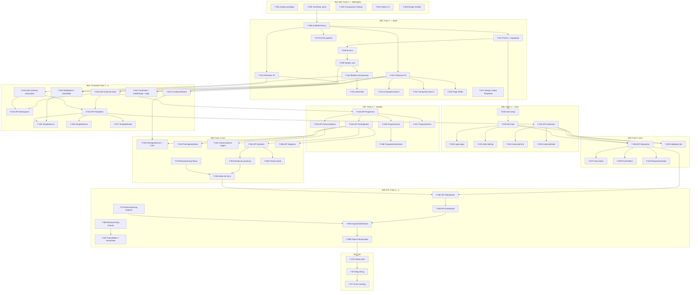

# FRACTUS -- Roadmap Micro-Detalhado v2.0

> **Versão:** 2.0
> **Data de referência:** 18/03/2026
> **Fonte:** Cronograma ClickUp + spec-desenvolvimento.md + business-rules.md + reunião alinhamento 17/03
> **Modelo:** Single-tenant | Next.js App Router + Supabase + Prisma + shadcn/ui
> **Changelog:** v1.1 → v2.0 — Semanas reestruturadas por módulo funcional, upstream deps explícitas, campo Responsável adicionado, Storybook incluído, marco produção 09/05.
>
> **Nota de nomenclatura (03/04/2026):** Este documento foi escrito antes da atualização do PRD de 02/04/2026. As decisões de timeline e entregas permanecem válidas, mas a nomenclatura está desatualizada: Programas→**Projetos**, Patrocinadores→**Investidores**, Formulários→**Pesquisas**. Negócio é agora **entidade primária** do MVP (não mais tag). Ver `clickup-sprints.md` para tasks atualizadas.

---

## Convenções

- **T-NNN** — ID da tarefa (sequencial global)
- **M***, **F***, **B*** — Referência à spec (Macroetapa, Front-end, Back-end)
- **BR-*** — Regra de negócio vinculada (business-rules.md)
- **[AC]** — Critério de aceite
- **Arquivo** — Caminho relativo a `packages/fractus/src/`
- **Responsável** — Douglas (D), Adriano novo (A), A definir (?)
- **Upstream dep** — Dependência de design/produto que deve estar entregue antes do início

---

## S01 — Semana 1 (02/03 - 08/03) | Fase 0: Definições

> **Marco:** Definições gerais (08/03)
> **Stream:** Upstream + Downstream (análise)

### T-001 | Análise do protótipo figma-make

| Campo | Valor |
|-------|-------|
| Ref | Fase 0 |
| Responsável | Compartilhado (D+A) |
| Escopo | Analisar `packages/fractus/figma-make/mod-gestao/` — levantar componentes, tipos, rotas, mock data, padrões reutilizáveis |
| Arquivos | `figma-make/mod-gestao/src/app/types.ts`, `routes.tsx`, `context/AppContext.tsx`, `utils/riskCalculator.ts` |
| Regras | -- |
| [AC] | Documento de análise com inventário de componentes (54+), tipos (15 interfaces), rotas (20+), e decisões de porte |

### T-002 | Confirmar stack e decisões arquiteturais

| Campo | Valor |
|-------|-------|
| Ref | Fase 0 |
| Responsável | Compartilhado (D+A) |
| Escopo | Confirmar: Next.js App Router, Supabase (PostgreSQL), Prisma ORM, Zod, shadcn/ui, Recharts, React Hook Form, Motion, PapaParse. Single-tenant. Deploy Vercel |
| Arquivos | -- |
| Regras | BR-MVP-001 a BR-MVP-010 (definir fronteira MVP vs V2) |
| [AC] | Decisões registradas em spec-desenvolvimento.md (seções 1, 2.1, 2.2). Lacunas L1 e L2 resolvidas |

### T-003 | Preencher cronograma ClickUp completo

| Campo | Valor |
|-------|-------|
| Ref | Fase 0 |
| Responsável | Compartilhado (D+A) |
| Escopo | Transferir itens do roadmap macro para ClickUp com datas, responsáveis, dependências |
| Arquivos | -- |
| Regras | -- |
| [AC] | ClickUp reflete roadmap-v1.md com 7 marcos, 5 fases, streams Upstream/Downstream |

---

## S02 — Semana 2 (08/03 - 15/03) | Fase 0: Definições (cont.)

> **Marco:** Início Tech (15/03)
> **Stream:** Upstream (Padronização UI, Gestão design) + Downstream (itens cronograma)

### T-004 | Padronização de UI — Tokens e guidelines

| Campo | Valor |
|-------|-------|
| Ref | Fase 0 / M2 |
| Responsável | Upstream (?) |
| Escopo | Definir tokens Tailwind (cores, fontes, espaçamentos, border-radius), paleta de cores, tipografia. Basear no protótipo figma-make |
| Arquivos | `app/globals.css`, `tailwind.config.ts` |
| Regras | BR-UX-001 a BR-UX-010 (padrões de navegação e UX) |
| [AC] | Tailwind config com tokens customizados. Cores e tipografia consistentes com protótipo |

### T-005 | Design de Gestão de programas (Upstream)

| Campo | Valor |
|-------|-------|
| Ref | Fase 0 |
| Responsável | Upstream (?) |
| Escopo | Design: telas de listagem, criação, edição, detalhe de programas. Definir layout de tabs, cards, filtros |
| Arquivos | -- (design) |
| Regras | BR-PRG-001 a BR-PRG-010, BR-UX-003, BR-UX-004, BR-UX-005 |
| [AC] | Specs visuais para ProgramasList, ProgramaForm, ProgramaDetail (5 tabs) |

---

## S03 — Semana 3 (15/03 - 22/03) | Fase 1: Base + Padronização

> **Stream:** Upstream (Coleta Templates design) + Downstream (scaffold, componentes)
> **Upstream dep:** Padronização de UI (08/03 - 15/03) — entregue

### T-006 | Scaffold Next.js App Router

| Campo | Valor |
|-------|-------|
| Ref | M1 / F1 |
| Responsável | Compartilhado (D+A) |
| Escopo | `create-next-app` com App Router, TypeScript, Tailwind v4, ESLint, Prettier. Configurar estrutura de pastas conforme spec seção 2.1 |
| Arquivos | Toda a estrutura `packages/fractus/src/` — `app/`, `components/`, `lib/`, `hooks/`, `types/`, `services/` |
| Regras | -- |
| [AC] | `pnpm dev` roda. Estrutura de diretórios match spec. Deploy preview no Vercel funcional |

### T-007 | Configurar Prisma + Supabase

| Campo | Valor |
|-------|-------|
| Ref | M1 / B1 |
| Responsável | Douglas (D) |
| Escopo | Instalar Prisma, configurar `DATABASE_URL` (Supabase connection string com pgBouncer), criar `prisma/schema.prisma` com todos 15 models e 5 enums conforme spec seção 2.2 |
| Arquivos | `prisma/schema.prisma`, `lib/prisma.ts`, `.env`, `.env.example` |
| Regras | -- |
| [AC] | `npx prisma migrate dev` cria todas as tabelas. `npx prisma studio` mostra 15 tabelas |

### T-008 | Prisma schema completo — Enums

| Campo | Valor |
|-------|-------|
| Ref | M3 / B1 |
| Responsável | Douglas (D) |
| Escopo | Implementar os 5 enums: `StatusParticipante` (5 valores), `TipoTemplate` (4), `TipoCampo` (4), `StatusNegocio` (4), `StatusInstancia` (3) |
| Arquivos | `prisma/schema.prisma` |
| Regras | BR-PRT-001 (status participante), BR-TPL-003 (tipos template), BR-TPL-004 (tipos campo), BR-ATR-006 (status instância) |
| [AC] | Enums criados, migration gerada sem erros |

### T-009 | Prisma schema completo — Models core

| Campo | Valor |
|-------|-------|
| Ref | M3 / B1 |
| Responsável | Douglas (D) |
| Escopo | Implementar models: `Patrocinador`, `Programa`, `ProgramaPatrocinador`, `Negocio`, `Tag`, `Participante`, `ParticipanteNegocio`, `Workspace`, `Template`, `CampoTemplate` |
| Arquivos | `prisma/schema.prisma` |
| Regras | BR-PRG-002 (campos programa), BR-PAT-003 (campos patrocinador), BR-TPL-001/002/005/006/007 (template + campos), BR-PRT-008/009 (tags + campos participante), BR-NEG-008 (campos negócio) |
| [AC] | 10 models com relações, indexes, cascades conforme spec. Migration sem erros |

### T-010 | Prisma schema completo — Models transacionais

| Campo | Valor |
|-------|-------|
| Ref | M3 / B1 |
| Responsável | Douglas (D) |
| Escopo | Implementar models: `Instancia`, `RespostaInstancia`, `Sessao`, `PresencaParticipante`, `PainelCustomizado`, `Usuario` |
| Arquivos | `prisma/schema.prisma` |
| Regras | BR-ATR-001/004/007/008/009/010 (instância), BR-RSP-003/008/009 (resposta), BR-PRS-002/003/007/008/009/012 (sessão + presença), BR-IMP-007 (painel), BR-AUT-005 (usuário) |
| [AC] | 6 models restantes. Unique constraints: `resposta_unica`, `sessao_participante`. Total: 15 models + 5 enums |

### T-011 | Seed data realista

| Campo | Valor |
|-------|-------|
| Ref | M3 / B2 |
| Responsável | Douglas (D) |
| Escopo | Script de seed com: 3 programas, 2 patrocinadores, 50 participantes (com tags variadas), 5 templates (1 por tipo + 1 satisfação), 10 instâncias, 30 respostas, 10 sessões com presença, 3 negócios |
| Arquivos | `prisma/seed.ts` |
| Regras | -- |
| [AC] | `npx prisma db seed` popula sem erros. Dados suficientes para testar todas as telas |

### T-012 | Instalar primitivos shadcn/ui P0

| Campo | Valor |
|-------|-------|
| Ref | M2 / F2 |
| Responsável | Adriano (A) |
| Escopo | `npx shadcn@latest add` 16 componentes P0: button, input, label, card, table, badge, select, tabs, dialog, sheet, checkbox, textarea, tooltip, separator, sonner, form |
| Arquivos | `components/ui/button.tsx`, `input.tsx`, `label.tsx`, `card.tsx`, `table.tsx`, `badge.tsx`, `select.tsx`, `tabs.tsx`, `dialog.tsx`, `sheet.tsx`, `checkbox.tsx`, `textarea.tsx`, `tooltip.tsx`, `separator.tsx`, `sonner.tsx`, `form.tsx` |
| Regras | -- |
| [AC] | 16 componentes renderizam corretamente. `cn()` configurado em `lib/utils.ts` |

### T-013 | Instalar primitivos shadcn/ui P1

| Campo | Valor |
|-------|-------|
| Ref | M2 / F5 |
| Responsável | Adriano (A) |
| Escopo | `npx shadcn@latest add` 8 componentes P1: calendar, popover, dropdown-menu, scroll-area, skeleton, progress, slider, radio-group |
| Arquivos | `components/ui/calendar.tsx`, `popover.tsx`, `dropdown-menu.tsx`, `scroll-area.tsx`, `skeleton.tsx`, `progress.tsx`, `slider.tsx`, `radio-group.tsx` |
| Regras | -- |
| [AC] | 8 componentes adicionais renderizam. Total: 24 primitivos |

### T-014 | Compostos base — PageHeader, EmptyState, SearchInput, ConfirmDialog

| Campo | Valor |
|-------|-------|
| Ref | M2 / F3 |
| Responsável | Adriano (A) |
| Escopo | Criar 4 compostos domain-agnostic. `PageHeader` (título + breadcrumb + ações), `EmptyState` (ícone + título + CTA), `SearchInput` (input + debounce), `ConfirmDialog` (dialog + ação destrutiva) |
| Arquivos | `components/ui/page-header.tsx`, `empty-state.tsx`, `search-input.tsx`, `confirm-dialog.tsx` |
| Regras | BR-UX-003 (busca e filtro), BR-UX-008 (breadcrumbs) |
| [AC] | 4 compostos renderizam. SearchInput tem debounce funcional (300ms) |

### T-015 | Compostos base — StatCard, StatusBadge, CountBadge, LoadingBadge, SortableTableHead

| Campo | Valor |
|-------|-------|
| Ref | M2 / F3 |
| Responsável | Adriano (A) |
| Escopo | Portar 5 compostos do figma-make: `StatCard` (card + tendência), `StatusBadge` (badge colorido por enum), `CountBadge` (numérico), `LoadingBadge` (spinner), `SortableTableHead` (sort por coluna) |
| Arquivos | `components/ui/stat-card.tsx`, `status-badge.tsx`, `count-badge.tsx`, `loading-badge.tsx`, `sortable-table-head.tsx` |
| Regras | BR-UX-006 (ordenação por colunas) |
| [AC] | Componentes portados e renderizando. StatusBadge aceita todos os 5 status de participante |

### T-016 | Page Shells — PlatformShell, AuthShell, FormShell

| Campo | Valor |
|-------|-------|
| Ref | M2 / F4 |
| Responsável | Adriano (A) |
| Escopo | Criar 3 layouts Next.js: `(platform)/layout.tsx` (sidebar + header + auth guard), `(auth)/layout.tsx` (centrado, minimal), `f/[id]/layout.tsx` (branding mínimo + barra progresso) |
| Arquivos | `app/(platform)/layout.tsx`, `app/(auth)/layout.tsx`, `app/f/[id]/layout.tsx`, `components/layout/sidebar.tsx`, `components/layout/header.tsx` |
| Regras | BR-UX-001 (nav global: Programas, Participantes, Patrocinadores, Templates), BR-UX-010 (submenus) |
| [AC] | Navegação entre layouts funcional. Sidebar com itens corretos. Auth guard redireciona para login |

### T-016b | Configurar Storybook

| Campo | Valor |
|-------|-------|
| Ref | M2 |
| Responsável | Douglas (D) |
| Escopo | Configurar Storybook para documentação visual de componentes. Stories para primitivos P0, compostos base e Page Shells. Facilitar review visual com Carolina/Design |
| Arquivos | `.storybook/`, `components/ui/*.stories.tsx` |
| Regras | -- |
| [AC] | `pnpm storybook` roda. Stories para Button, Card, StatCard, StatusBadge, PageHeader. Deploy preview opcional |

### T-075 | CI/CD pipeline (GitHub Actions + Vercel preview)

| Campo | Valor |
|-------|-------|
| Ref | M1 / Infra |
| Responsável | Douglas (D) |
| Escopo | Configurar GitHub Actions: lint + typecheck + test em PRs. Vercel preview deploys automáticos por PR. Branch protection rules |
| Arquivos | `.github/workflows/ci.yml`, `vercel.json` |
| Regras | -- |
| [AC] | PRs disparam CI (lint + typecheck + test). Preview deploy funcional por PR. Branch main protegida |

---

### T-017 | Design de Coleta — Templates (Upstream)

| Campo | Valor |
|-------|-------|
| Ref | Fase 1 |
| Responsável | Upstream (?) |
| Escopo | Design: telas de listagem/criação/edição de templates, editor de campos, workspace tabs |
| Arquivos | -- (design) |
| Regras | BR-TPL-001 a BR-TPL-016, BR-UX-003, BR-UX-006 |
| [AC] | Specs visuais para TemplatesList, TemplateForm (campo editor), TemplateDetail |

---

## S04 — Semana 4 (22/03 - 29/03) | Fase 2a: Coleta — Templates

> **Marco:** Início PO (29/03)
> **Stream:** Upstream (Auth, Coleta Respostas design) + Downstream (Zod, compostos avançados, Templates BE+FE)
> **Upstream dep:** Coleta - Criação e gestão de templates (15/03 - 22/03) — entregue
> **Módulo:** Templates (BE: B8, B9 | FE: F6, F14-F16)

### T-018 | Zod validation schemas — Enums e entidades base

| Campo | Valor |
|-------|-------|
| Ref | M5 / B3 |
| Responsável | Douglas (D) |
| Escopo | Criar schemas Zod para: enums (StatusParticipante, TipoTemplate, TipoCampo, StatusNegocio, StatusInstancia), entidades de criação/update (Programa, Participante, Patrocinador, Negocio, Tag) |
| Arquivos | `lib/validations/enums.ts`, `lib/validations/programa.ts`, `lib/validations/participante.ts`, `lib/validations/patrocinador.ts`, `lib/validations/negocio.ts`, `lib/validations/tag.ts` |
| Regras | RC-01 (Zod em lib/validations/), RC-02 (derivar de Prisma), RC-05 (validação server) |
| [AC] | Schemas exportam tipos inferidos (`z.infer<typeof>`) usáveis em FE e BE |

### T-019 | Zod validation schemas — Templates, Instâncias, Respostas, Sessões

| Campo | Valor |
|-------|-------|
| Ref | M5 / B3 |
| Responsável | Douglas (D) |
| Escopo | Schemas para: Template, CampoTemplate, Workspace, Instancia, RespostaInstancia, Sessao, PresencaParticipante, PainelCustomizado, Usuario |
| Arquivos | `lib/validations/template.ts`, `lib/validations/instancia.ts`, `lib/validations/resposta.ts`, `lib/validations/sessao.ts`, `lib/validations/painel.ts`, `lib/validations/usuario.ts`, `lib/validations/index.ts` |
| Regras | BR-TPL-005 (campos template), BR-ATR-004 (campos instância), BR-RSP-003 (campos resposta), BR-PRS-002 (campos sessão) |
| [AC] | Todos os 15+ schemas com tipos create/update. `index.ts` re-exporta tudo |

### T-020 | Compostos avançados — MultiSelect, DataTable

| Campo | Valor |
|-------|-------|
| Ref | M2 / F6 |
| Responsável | Adriano (A) |
| Escopo | Portar `MultiSelect` do figma-make (Popover + Command + Badge). Criar `DataTable` (Table + SortableTableHead + SearchInput + Select + Pagination) |
| Arquivos | `components/ui/multi-select.tsx`, `components/ui/data-table.tsx`, `hooks/use-table-sort.ts` |
| Regras | BR-UX-005 (paginação), BR-UX-006 (ordenação), BR-UX-007 (truncar nomes longos) |
| [AC] | MultiSelect com busca e badges. DataTable com sort, filtro, paginação funcionais |

### T-021 | Compostos avançados — FormField, DateRangePicker, TagBadge, TagFilter

| Campo | Valor |
|-------|-------|
| Ref | M2 / F6 |
| Responsável | Adriano (A) |
| Escopo | `FormField` (Label + Input/Select/Textarea + RHF error), `DateRangePicker` (Popover + Calendar + date-fns), `TagBadge` (Badge com cor por tipo), `TagFilter` (MultiSelect + TagBadge) |
| Arquivos | `components/ui/form-field.tsx`, `components/ui/date-range-picker.tsx`, `components/ui/tag-badge.tsx`, `components/ui/tag-filter.tsx` |
| Regras | BR-PRT-008 (tipos de tag: turma, negócio, grupo, cohort, outro) |
| [AC] | FormField integra com React Hook Form. DateRangePicker em pt-BR. TagBadge com 5 cores por tipo |

### T-022 | CsvImportWizard — Portar de Vue para React

| Campo | Valor |
|-------|-------|
| Ref | M2 / F6 |
| Responsável | Adriano (A) |
| Escopo | Portar `import_csv_map_vue` para React/shadcn/ui. 3 etapas: (1) upload drag-and-drop (.csv, 5MB, 5000 linhas), (2) mapeamento colunas via Select + preview 100 linhas, (3) confirmação com tabela completa + busca. Props: `columns`, `primaryColor`. Callback: `onComplete(mappedData[])` |
| Arquivos | `components/ui/csv-import-wizard.tsx`, `components/ui/csv-import-step-upload.tsx`, `components/ui/csv-import-step-mapping.tsx`, `components/ui/csv-import-step-confirm.tsx` |
| Regras | BR-PRT-014 (importação CSV), BR-MVP-007 (importação front-end) |
| Dependências | `papaparse` (npm install) |
| [AC] | Upload drag-and-drop funcional. Mapeamento visual de colunas. Preview de dados. Callback retorna array de objetos mapeados. Validação de arquivo (tipo, tamanho, linhas) |

### T-023 | API Workspaces — CRUD

| Campo | Valor |
|-------|-------|
| Ref | M9 / B8 |
| Responsável | Douglas (D) |
| Escopo | Endpoints: `GET /api/workspaces` (list com count templates), `POST /api/workspaces` (criar com nome único) |
| Arquivos | `app/api/workspaces/route.ts` |
| Regras | BR-TPL-002 (templates organizados em workspaces), BR-TPL-015 (governança) |
| [AC] | GET retorna workspaces com `_count.templates`. POST valida nome único (409 se duplicado) |

### T-024 | API Templates — CRUD completo

| Campo | Valor |
|-------|-------|
| Ref | M9 / B9 |
| Responsável | Douglas (D) |
| Escopo | `GET /api/templates` (list com filtro workspace/tipo/search, somente ativos), `GET /api/templates/[id]` (detail com campos + count instâncias), `POST /api/templates` (criar com campos), `PUT /api/templates/[id]` (update + versionamento), `DELETE /api/templates/[id]` (soft delete se tem respostas), `PUT /api/templates/[id]/desativar` |
| Arquivos | `app/api/templates/route.ts`, `app/api/templates/[id]/route.ts`, `app/api/templates/[id]/desativar/route.ts` |
| Regras | BR-TPL-001 (reutilizáveis), BR-TPL-005 (campos), BR-TPL-009 (não excluir com respostas), BR-TPL-010 (desativar faz link parar), BR-TPL-014 (edição bloqueada após vinculação) |
| Erros | `TEMPLATE_COM_RESPOSTAS` (422) |
| [AC] | Todos os endpoints retornam dados conforme Zod schema. Versionamento incrementa ao editar com respostas. Soft delete funcional |

### T-025 | TemplatesList page

| Campo | Valor |
|-------|-------|
| Ref | F14 |
| Responsável | Adriano (A) |
| Escopo | Página listagem de templates com tabs por workspace, filtro por tipo, busca por nome. Exibe: nome, tipo, fase, n perguntas, n respostas, status |
| Arquivos | `app/(platform)/templates/page.tsx`, `components/domain/template-card.tsx` |
| Regras | BR-TPL-013 (nav global), BR-TPL-016 (colunas da tabela) |
| [AC] | Tabs por workspace. DataTable com sort e filtro. TemplateCard renderiza corretamente |

### T-026 | TemplateForm page — Editor de campos

| Campo | Valor |
|-------|-------|
| Ref | F15 |
| Responsável | Adriano (A) |
| Escopo | Formulário criar/editar template com: nome, descrição, tipo, workspace, campos dinâmicos (adicionar/remover/reordenar), config por tipo de campo (opções para escolha, escala min/max com labels), marcação de indicador |
| Arquivos | `app/(platform)/templates/novo/page.tsx`, `app/(platform)/templates/[id]/editar/page.tsx`, `components/domain/campo-editor.tsx` |
| Regras | BR-TPL-004 (tipos de campo), BR-TPL-005 (configuração), BR-TPL-006 (isIndicador), BR-TPL-007 (escala) |
| [AC] | Drag-and-drop de campos. Config de escala (min, max, labels). Toggle isIndicador com input nomeIndicador. RHF + Zod validation |

### T-027 | TemplateDetail page

| Campo | Valor |
|-------|-------|
| Ref | F16 |
| Responsável | Adriano (A) |
| Escopo | Visualização read-only do template: campos, configuração, instâncias vinculadas. Botões: editar, duplicar, desativar/ativar |
| Arquivos | `app/(platform)/templates/[id]/page.tsx` |
| Regras | BR-TPL-008 (duplicar), BR-TPL-009 (desativar vs excluir) |
| [AC] | Lista de campos renderizada. Instâncias vinculadas listadas. Duplicação cria cópia editável |

---

## S05 — Semana 5 (29/03 - 05/04) | Fase 2a+2b: Templates (cont.) + Auth

> **Marco:** Auth + Templates prontos (05/04)
> **Stream:** Downstream (Auth BE+FE, Templates FE cont., Instâncias)
> **Upstream dep:** Autenticação (22/03 - 05/04) — em andamento (dev paralelo com 1 sem offset)
> **Módulos:** Templates (FE: F17-F18, BE: B10) + Auth (BE: B4, B17 | FE: F27)

### T-028 | Auth setup — Supabase Auth + middleware

| Campo | Valor |
|-------|-------|
| Ref | M4 / B4 |
| Responsável | Douglas (D) |
| Escopo | Configurar Supabase Auth: email/password para gestores, magic link para participantes. Middleware Next.js em `(platform)/` para validar sessão. Cookies HTTP-only |
| Arquivos | `lib/auth.ts`, `app/middleware.ts`, `.env` (SUPABASE_URL, SUPABASE_ANON_KEY, SUPABASE_SERVICE_ROLE_KEY) |
| Regras | BR-AUT-001 (login obrigatório), BR-AUT-005 (dois tipos: gestor/participante), BR-AUT-006 (participante sem área própria) |
| [AC] | Middleware redireciona não-autenticados para `/login`. Session persistida via cookies |

### T-029 | API Auth — Endpoints

| Campo | Valor |
|-------|-------|
| Ref | M4 / B4 |
| Responsável | Douglas (D) |
| Escopo | `POST /api/auth/login` (email/senha gestor), `POST /api/auth/magic-link` (email participante), `GET /api/auth/me`, `POST /api/auth/logout`, `GET /api/auth/callback` (magic link callback) |
| Arquivos | `app/api/auth/login/route.ts`, `app/api/auth/magic-link/route.ts`, `app/api/auth/me/route.ts`, `app/api/auth/logout/route.ts`, `app/api/auth/callback/route.ts` |
| Regras | BR-AUT-001 a BR-AUT-007 |
| [AC] | Login gestor retorna session. Magic link envia email. Callback redireciona para `/` ou `/f/[returnTo]` |

### T-030 | Login page

| Campo | Valor |
|-------|-------|
| Ref | F27 |
| Responsável | Adriano (A) |
| Escopo | Formulário login com toggle gestor (email/senha) vs participante (magic link). AuthShell layout |
| Arquivos | `app/(auth)/login/page.tsx` |
| Regras | BR-AUT-005 (dois tipos de usuário) |
| [AC] | Login gestor funcional. Magic link envia email e exibe mensagem de confirmação |

### T-076 | Rate limiting — Formulário público

| Campo | Valor |
|-------|-------|
| Ref | Infra / B17 |
| Responsável | Douglas (D) |
| Escopo | Implementar rate limiting nos endpoints públicos `/api/f/[linkId]` e `/api/respostas` (auto-save). Proteger contra abuso de submissão. Opções: Upstash Redis ou middleware Next.js |
| Arquivos | `lib/rate-limit.ts`, `app/api/f/[linkId]/route.ts`, `app/api/respostas/[id]/rascunho/route.ts` |
| Regras | -- |
| [AC] | Rate limit de 60 req/min por IP nos endpoints públicos. Retorna 429 com Retry-After header |

### T-031 | API Instâncias — CRUD + publicar

| Campo | Valor |
|-------|-------|
| Ref | M10 / B10 |
| Responsável | Douglas (D) |
| Escopo | `GET /api/instancias` (list com filtro programa/tipo, contagem respostas X/Y), `GET /api/instancias/[id]` (detail com template), `POST /api/instancias` (criar com tipo = tipo do template), `PUT /api/instancias/[id]/publicar` (gerar nanoid 8 chars, publishedAt), `PUT /api/instancias/[id]/despublicar` (manter link) |
| Arquivos | `app/api/instancias/route.ts`, `app/api/instancias/[id]/route.ts`, `app/api/instancias/[id]/publicar/route.ts`, `app/api/instancias/[id]/despublicar/route.ts` |
| Regras | BR-ATR-001 (atribuição), BR-ATR-002 (link não disparado), BR-ATR-003 (instância por segmento), BR-ATR-004/005 (campos + Y calculado), BR-ATR-006 (status), BR-ATR-007 (mensagem), BR-ATR-008 (prazo), BR-ATR-010 (tagsFiltro) |
| Dependências | `nanoid` (npm install) |
| [AC] | POST valida tipo = tipo do template. Publicar gera link `/f/[nanoid]`. Y calculado por participantes ativos |

### T-032 | InstanciaForm dialog

| Campo | Valor |
|-------|-------|
| Ref | F17 |
| Responsável | Adriano (A) |
| Escopo | Dialog para criar instância: selecionar template, programa, tags filtro, prazo validade, mensagem personalizada |
| Arquivos | `components/domain/instancia-form.tsx` |
| Regras | BR-ATR-001 (template → programa), BR-ATR-007 (mensagem), BR-ATR-008 (prazo), BR-ATR-010 (tags) |
| [AC] | Dialog funcional. Selects populados via API. Tags filtro com MultiSelect |

### T-033 | InstanciaDetail page

| Campo | Valor |
|-------|-------|
| Ref | F18 |
| Responsável | Adriano (A) |
| Escopo | Detalhe da instância: status, link (copy to clipboard), respostas X/Y, template info. Botões: publicar/despublicar |
| Arquivos | `app/(platform)/instancias/[id]/page.tsx`, `components/domain/instancia-card.tsx` |
| Regras | BR-ATR-004 (campos), BR-ATR-006 (status), BR-ATR-012 (rastreamento) |
| [AC] | Link copiável com toast. Status badge. Contagem X/Y em tempo real |

### T-034 | Design de Autenticação (Upstream)

| Campo | Valor |
|-------|-------|
| Ref | Fase 2 |
| Responsável | Upstream (?) |
| Escopo | Design: telas login gestor, magic link participante, página de erro (não cadastrado, sem acesso, prazo expirado) |
| Arquivos | -- (design) |
| Regras | BR-AUT-001 a BR-AUT-007 |
| [AC] | Specs visuais para login, callback, páginas de erro |

### T-035 | Design de Coleta — Respostas (Upstream)

| Campo | Valor |
|-------|-------|
| Ref | Fase 2 |
| Responsável | Upstream (?) |
| Escopo | Design: formulário público, auto-save indicator, tela de sucesso, visualização de respostas pelo gestor |
| Arquivos | -- (design) |
| Regras | BR-RSP-001 (auto-save), BR-RSP-002 (imutável), BR-RSP-004 (parciais), BR-RSP-010 (visualização) |
| [AC] | Specs visuais para FormPublico, RespostasViewer |

---

## S06 — Semana 6 (05/04 - 12/04) | Fase 2c: Coleta — Respostas

> **Marco:** Entregas D/P MVP (12/04)
> **Stream:** Upstream (Impacto, Painel Patrocinador design) + Downstream (Respostas BE+FE, Formulário público)
> **Upstream dep:** Coleta - Respostas (22/03 - 05/04) — entregue
> **Módulo:** Respostas (BE: B11, B12 | FE: F19, F20)

### T-036 | API Respostas — CRUD + auto-save + submit

| Campo | Valor |
|-------|-------|
| Ref | M11 / B11 |
| Responsável | Douglas (D) |
| Escopo | `GET /api/respostas?instanciaId=` (list com participante.nome), `GET /api/respostas/[id]` (detail), `POST /api/respostas` (criar com validação), `PUT /api/respostas/[id]/rascunho` (auto-save), `PUT /api/respostas/[id]/enviar` (submit final — valida obrigatórios, marca completedAt) |
| Arquivos | `app/api/respostas/route.ts`, `app/api/respostas/[id]/route.ts`, `app/api/respostas/[id]/rascunho/route.ts`, `app/api/respostas/[id]/enviar/route.ts` |
| Regras | BR-RSP-001 (auto-save), BR-RSP-002 (imutável após envio), BR-RSP-003 (campos vinculados), BR-RSP-005/007 (múltiplas respostas), BR-RSP-008/009 (datas + versão) |
| Erros | `INSTANCIA_NAO_PUBLICADA` (422), `PRAZO_EXPIRADO` (410), `PARTICIPANTE_NAO_VINCULADO` (403), `RESPOSTA_JA_ENVIADA` (409), `CAMPOS_OBRIGATORIOS_FALTANDO` (422) |
| [AC] | POST valida 6 regras do link público. Auto-save não marca completedAt. Submit valida campos obrigatórios |

### T-037 | Lógica auto-status — Participante → ativo

| Campo | Valor |
|-------|-------|
| Ref | B12 |
| Responsável | Douglas (D) |
| Escopo | Ao submeter resposta de `diagnostico_inicial`, atualizar participante.status para `ativo` e `respondeuDiagnosticoInicial = true` |
| Arquivos | `app/api/respostas/[id]/enviar/route.ts` (trigger no submit) |
| Regras | BR-PRT-004 (transição automática), RC-13 |
| [AC] | Submit de diagnostico_inicial muda status selecionado → ativo. Outros tipos não alteram status |

### T-038 | Validação de link público — Middleware

| Campo | Valor |
|-------|-------|
| Ref | B17 |
| Responsável | Douglas (D) |
| Escopo | `GET /api/f/[linkId]` — validar 6 regras: link existe, instância publicada, prazo válido, participante autenticado vinculado ao programa, tags filtro match, resposta única |
| Arquivos | `app/api/f/[linkId]/route.ts` |
| Regras | BR-AUT-001/002/003/004 (validação), BR-AUT-007 (elegibilidade), BR-ATR-008 (prazo), BR-ATR-010 (tags), BR-RSP-007 (bloqueio) |
| [AC] | Cada cenário retorna erro específico (403, 410, 409, 422). Caso OK retorna instância + template + participante |

### T-039 | FormPublico page — Renderizador de campos

| Campo | Valor |
|-------|-------|
| Ref | F19 |
| Responsável | Adriano (A) |
| Escopo | Página `/f/[id]` — renderiza formulário para participante. `CampoRenderer` renderiza campo conforme tipo (texto → Input, escolha_unica → RadioGroup, multipla_escolha → Checkbox group, escala → Slider). Auto-save via debounce 3s. Submit marca completedAt. FormShell com barra de progresso |
| Arquivos | `app/f/[id]/page.tsx`, `components/domain/campo-renderer.tsx`, `components/domain/form-publico.tsx`, `hooks/use-form-autosave.ts` |
| Regras | BR-RSP-001 (auto-save), BR-RSP-002 (imutável após envio), BR-RSP-004 (parciais registradas), RC-11 (debounce 3s) |
| [AC] | 4 tipos de campo renderizam. Auto-save a cada 3s. Barra de progresso. Tela de sucesso após envio. Campos obrigatórios validados no submit |

### T-040 | RespostasViewer pages

| Campo | Valor |
|-------|-------|
| Ref | F20 / M12 |
| Responsável | Adriano (A) |
| Escopo | 3 páginas de respostas (formulários, satisfação, sessão): DataTable com participante, data envio, status. Detalhe expandível por participante (respostas por pergunta) |
| Arquivos | `app/(platform)/programas/[id]/formularios/[templateId]/respostas/page.tsx`, `app/(platform)/programas/[id]/satisfacao/[templateId]/respostas/page.tsx`, `app/(platform)/programas/[id]/sessoes/[sessaoId]/respostas/page.tsx`, `components/domain/respostas-viewer.tsx` |
| Regras | BR-RSP-010 (visualização por participante, por pergunta) |
| [AC] | DataTable com respostas. Expandir mostra respostas individuais. Filtro por status (completa/parcial) |

### T-041 | Design de Impacto (Upstream)

| Campo | Valor |
|-------|-------|
| Ref | Fase 2 |
| Responsável | Upstream (?) |
| Escopo | Design: dashboard impacto, cards indicadores, gráficos, filtros, painéis customizados |
| Regras | BR-IMP-001 a BR-IMP-008 |
| [AC] | Specs visuais para ImpactoDashboard, IndicadorCard, PainelEditor |

### T-042 | Design Painel Patrocinador (Upstream)

| Campo | Valor |
|-------|-------|
| Ref | Fase 2 |
| Responsável | Upstream (?) |
| Escopo | Design: view read-only para patrocinador, filtrada por programa |
| Regras | BR-PAT-005/006 (sem acesso operacional, painel visualização) |
| [AC] | Specs visuais para PatrocinadorDashboard |

---

## S07 — Semana 7 (12/04 - 19/04) | Fase 2c (cont.) + Fase 3a: Gestão de Programas

> **Marco:** Coleta completa (15/04)
> **Stream:** Upstream (Integração educacional design) + Downstream (Respostas FE finalização, Gestão BE início)
> **Upstream dep:** Gestão de programas (08/03 - 15/03) — entregue (~4 sem buffer)
> **Módulo:** Gestão (BE: B5, B6, B7 | FE: F7-F9)

### T-043 | API Programas — CRUD completo

| Campo | Valor |
|-------|-------|
| Ref | M6 / B5 |
| Responsável | Douglas (D) |
| Escopo | `GET /api/programas` (list com search, paginação, ordenar por dataInicio DESC), `GET /api/programas/[id]` (detail com patrocinadores populados), `POST /api/programas` (criar com patrocinadorIds), `PUT /api/programas/[id]` (partial update), `DELETE /api/programas/[id]` (cascade) |
| Arquivos | `app/api/programas/route.ts`, `app/api/programas/[id]/route.ts`, `services/programas.ts` |
| Regras | BR-PRG-002/003/004 (campos), BR-PRG-006 (segmentos por tags), BR-PRG-009 (edição) |
| Erros | `PROGRAMA_NAO_ENCONTRADO` (404), `DATA_FIM_ANTERIOR_INICIO` (422) |
| [AC] | CRUD completo. dataFim > dataInicio validado. Cascade deleta participantes, instâncias, sessões |

### T-044 | API Participantes — CRUD + bulk import

| Campo | Valor |
|-------|-------|
| Ref | M7 / B6 |
| Responsável | Douglas (D) |
| Escopo | `GET /api/participantes?programaId=` (filtro por tags, status, search, paginação), `GET /api/participantes/[id]` (detail com relations), `POST /api/participantes` (criar com tags), `PUT /api/participantes/[id]` (update + status transitions), `DELETE /api/participantes/[id]` (cascade), `POST /api/participantes/bulk` (importação CSV — max 5000, transacional) |
| Arquivos | `app/api/participantes/route.ts`, `app/api/participantes/[id]/route.ts`, `app/api/participantes/bulk/route.ts`, `services/participantes.ts` |
| Regras | BR-PRT-001 (status), BR-PRT-002 (default pre_selecionado), BR-PRT-005 (manual pelo gestor), BR-PRT-006 (múltiplos programas), BR-PRT-007 (negócios), BR-PRT-008 (tags), BR-PRT-009 (campos), BR-PRT-014 (CSV) |
| Erros | `PARTICIPANTE_JA_VINCULADO` (409), `TRANSICAO_STATUS_INVALIDA` (422) |
| [AC] | Filtro por tags: AND dentro do mesmo tipo, OR entre tipos. Bulk import transacional. Email único dentro do programa |

### T-045 | API Patrocinadores — CRUD

| Campo | Valor |
|-------|-------|
| Ref | M8 / B7 |
| Responsável | Douglas (D) |
| Escopo | `GET /api/patrocinadores` (list com search, paginação), `POST /api/patrocinadores` (nome + logo), `PUT /api/patrocinadores/[id]` (update) |
| Arquivos | `app/api/patrocinadores/route.ts`, `app/api/patrocinadores/[id]/route.ts` |
| Regras | BR-PAT-001 (nav global), BR-PAT-002 (deve existir antes do programa), BR-PAT-003 (criação simples), BR-PAT-007 (múltiplos programas) |
| [AC] | CRUD funcional. Logo upload via Supabase Storage |

### T-046 | ProgramasList page

| Campo | Valor |
|-------|-------|
| Ref | F7 |
| Responsável | Adriano (A) |
| Escopo | Listagem de programas com ProgramaCard (nome, período, presença, patrocinadores) + DataTable + filtros + busca |
| Arquivos | `app/(platform)/programas/page.tsx`, `components/domain/programa-card.tsx` |
| Regras | BR-PRG-008 (nav global), BR-PRG-010 (colunas tabela), BR-UX-003 (busca/filtro), BR-UX-004 (métricas colapsáveis) |
| [AC] | Cards com métricas. DataTable com sort. Busca por nome. Métricas no topo (fold/unfold) |

### T-047 | ProgramaForm page

| Campo | Valor |
|-------|-------|
| Ref | F8 |
| Responsável | Adriano (A) |
| Escopo | Formulário criar/editar programa: nome, descrição, datas (DateRangePicker), totalInscritos, quantidadeVagas, patrocinadores (MultiSelect checkbox) |
| Arquivos | `app/(platform)/programas/novo/page.tsx`, `app/(platform)/programas/[id]/editar/page.tsx` |
| Regras | BR-PRG-002 (campos), BR-PRG-004 (vagas), BR-PRG-009 (edição), BR-PAT-008 (checkbox para patrocinador) |
| [AC] | RHF + Zod validation. DateRangePicker seleciona início/fim. MultiSelect de patrocinadores |

### T-048 | ProgramaDetail page — Estrutura de tabs

| Campo | Valor |
|-------|-------|
| Ref | F9 |
| Responsável | Adriano (A) |
| Escopo | Página detalhe com 5 tabs: Participantes, Negócios, Aulas (presença), Formulários, Satisfação. Header com nome, período, botão editar |
| Arquivos | `app/(platform)/programas/[id]/page.tsx` |
| Regras | BR-PRG-005 (tabs), BR-UX-008 (breadcrumbs/voltar) |
| [AC] | 5 tabs navegáveis. Header com dados do programa. Breadcrumb funcional |

---

## S08 — Semana 8 (19/04 - 26/04) | Fase 3a: Gestão de Programas (cont.)

> **Marco:** Entrega de Desenvolvimento (26/04)
> **Stream:** Downstream (Gestão: participantes FE, sessões BE+FE, presença, motor de risco, negócios)
> **Módulo:** Gestão (BE: B13, B14, B15, B16 | FE: F10-F13, F21)
> **⚠️ Nota timing:** T-060 (Loading/Error states, F28) foi antecipado do Macro Fase 4 para S08 para permitir que todas as pages da Fase 3a já tenham loading states desde o início. Desvio intencional vs Roadmap Macro.

### T-049 | ParticipantesList tab + ImportCSV

| Campo | Valor |
|-------|-------|
| Ref | F10 |
| Responsável | Adriano (A) |
| Escopo | Tab dentro do programa: DataTable de participantes (nome, email, status, presença, risco, negócio, WhatsApp). Drawer add/edit. Botão "Importar CSV" abre CsvImportWizard (colunas: nome, email, telefone, dataNascimento) → POST /api/participantes/bulk |
| Arquivos | `components/domain/participantes-list-tab.tsx`, `components/domain/participante-row.tsx` |
| Regras | BR-PRT-009 (campos), BR-PRT-010 (indicadores), BR-PRT-013 (edição inline), BR-PRT-014 (importação CSV), BR-PRT-017 (negócio + WhatsApp), BR-PRT-018 (permissão gestor) |
| [AC] | DataTable com todas as colunas. Importação CSV funcional via wizard. Status badge colorido. Link WhatsApp |

### T-050 | ParticipanteDetail page

| Campo | Valor |
|-------|-------|
| Ref | F11 |
| Responsável | Adriano (A) |
| Escopo | Detalhe individual: dados pessoais, tags, histórico de respostas, presenças, nível de risco |
| Arquivos | `app/(platform)/participantes/[id]/page.tsx` |
| Regras | BR-PRT-010 (indicadores), BR-PRT-013 (dados pendentes vs completos), BR-PRT-016 (pode ser V2 - implementar simplificado) |
| [AC] | Cards com métricas. Lista de respostas. Lista de presenças. RiskBadge |

### T-051 | PatrocinadoresList page + PatrocinadorDetail drawer

| Campo | Valor |
|-------|-------|
| Ref | F12 / F13 |
| Responsável | Adriano (A) |
| Escopo | Listagem global de patrocinadores com PatrocinadorCard (nome, logo, programas vinculados). Detail abre em drawer (não página nova): nome editável, programas listados |
| Arquivos | `app/(platform)/patrocinadores/page.tsx`, `components/domain/patrocinador-card.tsx`, `components/domain/patrocinador-detail-drawer.tsx` |
| Regras | BR-PAT-001 (nav global), BR-PAT-003/004 (criação simples, drawer), BR-PAT-007 (programas vinculados), BR-UX-002 (drawer) |
| [AC] | DataTable + cards. Drawer abre com nome editável. Lista de programas vinculados |

### T-052 | API Sessões + Presença — CRUD completo

| Campo | Valor |
|-------|-------|
| Ref | M13 / B13 |
| Responsável | Douglas (D) |
| Escopo | `GET /api/sessoes?programaId=` (list com presenças, ordenar por data DESC), `POST /api/sessoes` (criar com snapshot denominador), `PUT /api/sessoes/[id]` (update + presença array), `DELETE /api/sessoes/[id]` (cascade) |
| Arquivos | `app/api/sessoes/route.ts`, `app/api/sessoes/[id]/route.ts`, `services/sessoes.ts` |
| Regras | BR-PRS-001 (organizada por sessões), BR-PRS-002 (campos sessão), BR-PRS-003 (denominador fixado), BR-PRS-006 (modo corretivo), BR-PRS-007 (instância satisfação), BR-PRS-008 (tipo manual/inferida), BR-PRS-009 (tagsFiltro), BR-PRS-016 (edição limitada) |
| [AC] | POST fixa snapshot do denominador. PUT recalcula percentualPresenca. Cascade deleta presenças |

### T-053 | Recálculo presença — Service function

| Campo | Valor |
|-------|-------|
| Ref | B14 |
| Responsável | Douglas (D) |
| Escopo | Service function: recalcular `percentualPresenca` e `faltasConsecutivas` de cada participante após mutação em PresencaParticipante. Chamada em B13 (sessões PUT/DELETE) |
| Arquivos | `services/presenca.ts` |
| Regras | BR-PRS-013 (corrigir inconsistências), RC-14 (recálculo via trigger) |
| [AC] | percentualPresenca = presentes / total sessões * 100. faltasConsecutivas conta sequência contínua |

### T-078 | [Brainstorming gate] Motor de risco — Explorar abordagens

| Campo | Valor |
|-------|-------|
| Ref | M14 / Decisão |
| Responsável | Douglas (D) |
| Escopo | Gate obrigatório antes de implementar B15. Explorar 2-3 abordagens para o motor de risco: (1) portar riskCalculator.ts do protótipo, (2) ML-based com dados de presença, (3) rule-based configurável. Documentar trade-offs e escolher |
| Arquivos | `docs/brainstorming/motor-de-risco.md` |
| Regras | Fluxo 6 business-rules.md |
| [AC] | Documento com 2-3 abordagens analisadas, trade-offs, decisão final. Aprovado por Douglas + Carolina |

### T-054 | Motor de risco — Server-side

| Campo | Valor |
|-------|-------|
| Ref | M14 / B15 |
| Responsável | Douglas (D) |
| Escopo | Portar `riskCalculator.ts` do figma-make para server-side. 7 fatores, 4 níveis (baixo 0-25, médio 26-50, alto 51-75, crítico 76-100). Expor como campo computado na API de participantes |
| Arquivos | `lib/risk-calculator.ts`, `services/participantes.ts` (integrar no GET) |
| Regras | Fluxo 6 business-rules.md (motor de risco completo) |
| [AC] | Lógica idêntica ao protótipo. Desistente = 100 pts. Retorna { score, level, factors[] } |

### T-055 | RiskBadge componente

| Campo | Valor |
|-------|-------|
| Ref | F3 (domain) |
| Responsável | Adriano (A) |
| Escopo | Badge de nível de risco: 🟢 Baixo, 🟡 Médio, 🟠 Alto, 🔴 Crítico. Cor conforme nível. Tooltip com fatores |
| Arquivos | `components/domain/risk-badge.tsx` |
| Regras | -- |
| [AC] | 4 cores. Tooltip lista fatores ativos |

### T-056 | PresencaTab + SessaoForm

| Campo | Valor |
|-------|-------|
| Ref | F21 |
| Responsável | Adriano (A) |
| Escopo | Tab Aulas/Presença dentro do programa: lista de sessões (SessaoCard), criar sessão (Sheet com nome, data, incluir NPS?), matriz presença (participantes x sessões), modo corretivo manual, visualização tabela por sessão vs matriz por aluno |
| Arquivos | `components/domain/presenca-tab.tsx`, `components/domain/sessao-card.tsx`, `components/domain/presenca-matrix.tsx`, `components/domain/sessao-form.tsx` |
| Regras | BR-PRS-001 a BR-PRS-017 (todas as regras de presença), Fluxo 4 business-rules.md |
| [AC] | Criar sessão com/sem NPS. Snapshot do denominador. Checkbox presença. Recálculo automático. Duas visualizações: tabela por sessão e matriz por aluno |

### T-057 | FormulariosTab + SatisfacaoTab

| Campo | Valor |
|-------|-------|
| Ref | F22 / F23 |
| Responsável | Adriano (A) |
| Escopo | Tab Formulários: lista instâncias tipo diagnostico_*, botão criar instância (InstanciaForm). Tab Satisfação: lista instâncias tipo satisfacao_nps, vínculo com sessão |
| Arquivos | `components/domain/formularios-tab.tsx`, `components/domain/satisfacao-tab.tsx` |
| Regras | BR-ATR-001 (atribuição template→programa), BR-TPL-003 (tipos de template) |
| [AC] | Tabs listam instâncias filtradas por tipo. Botão criar abre InstanciaForm. Cards X/Y respostas |

### T-058 | API Negócios — CRUD

| Campo | Valor |
|-------|-------|
| Ref | M15 / B16 |
| Responsável | Douglas (D) |
| Escopo | `GET /api/negocios?projetoId=` (list com participantes), `POST /api/negocios` (pre-cadastro com lider), `PUT /api/negocios/[id]` (update), `DELETE /api/negocios/[id]` (cascade) |
| Arquivos | `app/api/negocios/route.ts`, `app/api/negocios/[id]/route.ts` |
| Regras | BR-NEG-001 (entidade primaria MVP), BR-NEG-002 (pre-cadastro manual), BR-NEG-003 (FK projeto), BR-NEG-012 (email validation) |
| [AC] | CRUD completo. Pre-cadastro com lider_nome, lider_email, telefone. Email unico por projeto |
| **Nota** | **Expandida em T-083 (clickup-sprints.md). Negocio e agora entidade primaria, nao tag.** |

### T-059 | NegociosTab

| Campo | Valor |
|-------|-------|
| Ref | F9 (tab) |
| Responsável | Adriano (A) |
| Escopo | Tab Negocios dentro do projeto: tabela com nome, lider, status, diagnostico, membros, acoes. Drawer com 2 abas (Cadastro + Pesquisas). Botao "Copiar link de diagnostico" |
| Arquivos | `app/(platform)/projetos/[id]/components/negocios-tab.tsx`, `components/domain/detalhes-negocio-drawer.tsx` |
| Regras | BR-NEG-001 (entidade primaria), BR-NEG-008 (tabela), BR-NEG-009 (drawer 2 abas), BR-NEG-010 (acoes) |
| [AC] | Tabela com colunas do PRD. Drawer 2 abas funcional. Copy link funcional |
| **Nota** | **Expandida em T-087, T-088, T-089, T-091 (clickup-sprints.md).** |

### T-060 | Loading + Error states globais

| Campo | Valor |
|-------|-------|
| Ref | F28 |
| Responsável | Adriano (A) |
| Escopo | Adicionar `loading.tsx` e `error.tsx` em todos os segmentos de rota. Skeleton components para listas e cards |
| Arquivos | `app/(platform)/programas/loading.tsx`, `error.tsx`, etc. (em todos os segmentos) |
| Regras | RC-08 (loading.tsx ou Skeleton), RC-09 (error.tsx boundaries) |
| [AC] | Todas as rotas têm loading/error states. Skeletons para tabelas e cards |

---

## S09 — Semana 9 (26/04 - 03/05) | Fase 3a (finalização) + Fase 3b: Impacto início

> **Marco:** Gestão completa (03/05)
> **Stream:** Downstream (Gestão finalização, Deploy staging, Impacto BE início)
> **Upstream dep:** Impacto (05/04 - 15/04) — entregue
> **⚠️ ATENÇÃO:** Regras de negócio de Impacto e Painel do Patrocinador ainda NÃO definidas (confirmado reunião 17/03). Brainstorming gates obrigatórios.
> **⚠️ Nota timing:** T-061 (Deploy) e T-065 (Expirar instâncias, B21) foram antecipados do Macro Fase 4 para S09 para viabilizar testes integrados no ambiente de produção antes da Fase 4 QA.

### T-061 | Deploy Vercel + Supabase produção

| Campo | Valor |
|-------|-------|
| Ref | M1 |
| Responsável | Compartilhado (D+A) |
| Escopo | Configurar projeto Vercel, environment variables de produção, domínio customizado. Supabase projeto de produção com migrations aplicadas |
| Arquivos | `vercel.json`, `.env.production` |
| Regras | -- |
| [AC] | App acessível via domínio. Supabase produção com schema atualizado. Seed de produção executado |

### T-062 | API Impacto — Indicadores

| Campo | Valor |
|-------|-------|
| Ref | M16 / B18 |
| Responsável | Douglas (D) |
| Escopo | `GET /api/impacto/indicadores?programaId=&tagsFiltro=` — agregar respostas diagnostico_inicial vs diagnostico_final para campos com `isIndicador: true`. Calcular delta absoluto e percentual por indicador |
| Arquivos | `app/api/impacto/indicadores/route.ts`, `services/impacto.ts` |
| Regras | BR-IMP-001 (inicial vs final), BR-IMP-002 (dados suficientes), BR-IMP-003 (valor, delta, percentual), BR-IMP-006 (campos isIndicador), Fluxo 5 business-rules.md |
| [AC] | Retorna array de Indicador com: nome, campoId, valorInicial, valorFinal, deltaAbsoluto, deltaPercentual |

### T-063 | API Impacto — Dashboard

| Campo | Valor |
|-------|-------|
| Ref | M16 / B19 |
| Responsável | Douglas (D) |
| Escopo | `GET /api/impacto/dashboard?programaId=&tagsFiltro=` — estatísticas agregadas: totalParticipantes, mediaPresenca, taxaConclusao, taxaEvasao, distribuicaoRisco. `GET /api/impacto/evolucao?indicadorNome=&programaId=` — data points para gráficos |
| Arquivos | `app/api/impacto/dashboard/route.ts`, `app/api/impacto/evolucao/route.ts` |
| Regras | BR-IMP-004 (dashboard: comparação, média, evolução, filtros) |
| [AC] | Dashboard retorna métricas agregadas. Evolução retorna data points (inicial → meio → final) |

### T-064 | API Painéis — CRUD

| Campo | Valor |
|-------|-------|
| Ref | M17 / B20 |
| Responsável | Douglas (D) |
| Escopo | `GET /api/paineis`, `POST /api/paineis`, `PUT /api/paineis/[id]`, `DELETE /api/paineis/[id]` |
| Arquivos | `app/api/paineis/route.ts`, `app/api/paineis/[id]/route.ts` |
| Regras | BR-IMP-007 (painéis customizados: indicadores, filtros, visualização) |
| [AC] | CRUD funcional. Tipos de visualização: cards, tabela, gráfico barras, gráfico linhas |

### T-065 | Expirar instâncias — Lazy check

| Campo | Valor |
|-------|-------|
| Ref | B21 |
| Responsável | Douglas (D) |
| Escopo | Na leitura de instância, verificar se `prazoValidade < now()` e marcar como `expirado` |
| Arquivos | `services/instancias.ts` |
| Regras | BR-ATR-008 (prazo expirado → link para de funcionar) |
| [AC] | Instância expirada retorna status `expirado`. Link exibe mensagem genérica |

---

## S10 — Semana 10 (03/05 - 10/05) | Fase 3b: Impacto + Painéis

> **Marco:** Plataforma no ar (09/05)
> **Stream:** Upstream (Discovery V2) + Downstream (Impacto FE, Painéis BE+FE, Painel Patrocinador)
> **Upstream dep:** Painel do Patrocinador (05/04 - 15/04) — entregue
> **Módulo:** Impacto + Painéis (BE: B18-B20 | FE: F24-F26)

### T-079 | [Brainstorming gate] Dashboard de impacto — Explorar visualizações

| Campo | Valor |
|-------|-------|
| Ref | M16 / Decisão |
| Responsável | Adriano (A) |
| Escopo | Gate obrigatório antes de implementar F24. Explorar visualizações: (1) cards + gráficos Recharts, (2) dashboard builder drag-and-drop, (3) tabular + export. Alinhar com specs de Produto (se disponíveis) |
| Arquivos | `docs/brainstorming/dashboard-impacto.md` |
| Regras | BR-IMP-001 a BR-IMP-008 |
| [AC] | Documento com opções de visualização, wireframes low-fi, decisão final. Aprovado por Carolina |

### T-066 | ImpactoDashboard page

| Campo | Valor |
|-------|-------|
| Ref | F24 |
| Responsável | Adriano (A) |
| Escopo | Dashboard com: IndicadorCard (valor inicial/final + delta), IndicadorChart (Recharts bar/line), DashboardFilter (programa + tags + período), métricas gerais (participantes, presença, conclusão, evasão, risco) |
| Arquivos | `app/(platform)/impacto/page.tsx`, `components/domain/indicador-card.tsx`, `components/domain/indicador-chart.tsx`, `components/domain/dashboard-filter.tsx` |
| Regras | BR-IMP-001 a BR-IMP-008, Fluxo 5 business-rules.md |
| [AC] | Dashboard renderiza. Filtros funcionais. Gráficos Recharts (bar + line). Cards com delta colorido |

### T-080 | [Brainstorming gate] Painéis customizados — Explorar UX editor

| Campo | Valor |
|-------|-------|
| Ref | M17 / Decisão |
| Responsável | Adriano (A) |
| Escopo | Gate obrigatório antes de implementar F25. Explorar UX do editor de painéis: (1) wizard step-by-step, (2) canvas drag-and-drop, (3) template gallery pré-configurado. Balancear complexidade vs prazo MVP |
| Arquivos | `docs/brainstorming/paineis-customizados.md` |
| Regras | BR-IMP-007 |
| [AC] | Documento com 2-3 opções de UX, wireframes, decisão final. Aprovado por Carolina + Douglas |

### T-067 | PainelEditor + PainelView

| Campo | Valor |
|-------|-------|
| Ref | F25 |
| Responsável | Adriano (A) |
| Escopo | Criar/editar painel customizado: Dialog com MultiSelect indicadores, Select visualização (cards/tabela/barras/linhas), filtros programa + tags. View renderiza painel salvo |
| Arquivos | `components/domain/painel-editor.tsx`, `components/domain/painel-view.tsx` |
| Regras | BR-IMP-007 (painéis customizados) |
| [AC] | Editor funcional. View renderiza conforme tipo selecionado. CRUD via API |

### T-068 | Painel do Patrocinador page

| Campo | Valor |
|-------|-------|
| Ref | F26 / M18 |
| Responsável | Adriano (A) |
| Escopo | View read-only para patrocinador: dashboard pré-configurado por programa, sem auth operacional. URL pública com token ou ID |
| Arquivos | `app/(platform)/patrocinadores/[id]/impacto/page.tsx` (ou rota pública separada) |
| Regras | BR-PAT-005 (sem acesso operacional), BR-PAT-006 (painel visualização), BR-IMP-005 (sem relatório narrativo) |
| [AC] | View renderiza indicadores filtrados por patrocinador. Sem login necessário (URL com token) |

### T-069 | Discovery V2 (Upstream)

| Campo | Valor |
|-------|-------|
| Ref | Fase 4 |
| Responsável | Upstream (?) |
| Escopo | Pesquisa e definição de funcionalidades V2: inscrição pela plataforma, automação de disparos, negócio como entidade formal, versionamento avançado |
| Regras | BR-MVP-003 a BR-MVP-010 |
| [AC] | Backlog V2 priorizado e documentado |

---

## S11 — Semana 11 (10/05 - 17/05) | Fase 4: QA + Deploy

> **Marco:** Entrega do MVP (17/05)
> **Stream:** QA + Deploy produção + Ideação V2
> **Módulo:** QA (BE: B21 | FE: F28)

### T-070 | Testes E2E — Fluxos críticos

| Campo | Valor |
|-------|-------|
| Ref | M19 |
| Responsável | Compartilhado (D+A) |
| Escopo | Playwright: (1) Login gestor + criar programa + adicionar participantes (manual + CSV), (2) Criar template + atribuir + publicar + copiar link, (3) Login participante (magic link) + responder formulário + auto-save + submit, (4) Verificar dashboard impacto com dados, (5) Presença: criar sessão + registrar + verificar percentual |
| Arquivos | `tests/e2e/` |
| Regras | Todos os fluxos (Fluxos 1-6 business-rules.md) |
| [AC] | 5 cenários E2E passando. CI/CD integrado |

### T-071 | Auditoria de acessibilidade

| Campo | Valor |
|-------|-------|
| Ref | M19 |
| Responsável | Compartilhado (D+A) |
| Escopo | Lighthouse audit > 80. Verificar: labels em inputs, contraste, foco keyboard, aria-labels, alt texts |
| Arquivos | Todos os componentes e pages |
| Regras | -- |
| [AC] | Lighthouse Accessibility > 80. Navegação via teclado funcional |

### T-072 | Performance audit

| Campo | Valor |
|-------|-------|
| Ref | M19 |
| Responsável | Compartilhado (D+A) |
| Escopo | Lighthouse Performance > 80. Verificar: bundle size, image optimization, Server Components, lazy loading |
| Arquivos | Configurações Next.js |
| Regras | -- |
| [AC] | Lighthouse Performance > 80. First Contentful Paint < 1.5s |

### T-073 | Bug fixing e polish

| Campo | Valor |
|-------|-------|
| Ref | M19 |
| Responsável | Compartilhado (D+A) |
| Escopo | Resolver bugs encontrados em QA, ajustar UX conforme feedback, corrigir edge cases |
| Arquivos | Variados |
| Regras | -- |
| [AC] | Zero bugs críticos. Fluxos E2E passando. Stakeholders aprovam |

### T-077 | Error tracking (Sentry)

| Campo | Valor |
|-------|-------|
| Ref | M19 / Infra |
| Responsável | Douglas (D) |
| Escopo | Instalar e configurar Sentry para Next.js. Source maps em produção. Captura de erros server-side e client-side. Alertas por severidade |
| Arquivos | `sentry.client.config.ts`, `sentry.server.config.ts`, `next.config.ts` (withSentryConfig) |
| Regras | -- |
| [AC] | Erros capturados em Sentry. Source maps funcionais. Dashboard Sentry acessível. Alertas configurados |

### T-074 | Documentação de uso

| Campo | Valor |
|-------|-------|
| Ref | M19 |
| Responsável | Compartilhado (D+A) |
| Escopo | README com setup, comandos, env vars. Guia de uso para gestores (como criar programa, atribuir template, visualizar impacto) |
| Arquivos | `packages/fractus/README.md` |
| Regras | -- |
| [AC] | README cobre setup completo. Guia de uso com screenshots |

---

## Diagrama de dependências entre tarefas

---

## Estatísticas

| Métrica | Valor |
|---------|-------|
| Total de tarefas | 81 (T-001 a T-080, inclui T-016b) |
| Semanas (sprints) | 11 |
| Endpoints de API | 40+ |
| Componentes UI | 54 primitivos + 14 compostos + 18 domínio + 3 shells |
| Models Prisma | 15 |
| Schemas Zod | 15+ |
| Regras de negócio vinculadas | 135 (BR-*) |
| Testes E2E | 5 cenários |

---

> **Referências:**
> - [spec-desenvolvimento.md](spec-desenvolvimento.md) -- Especificação técnica completa (890 linhas)
> - [business-rules.md](business-rules.md) -- 135 regras de negócio + 6 fluxogramas Mermaid
> - [roadmap-v1.md](roadmap-v1.md) -- Roadmap macro v2.0 (7 sub-fases, 10 marcos)
> - `packages/fractus/figma-make/mod-gestao/` -- Protótipo funcional de referência
> - `C:\Users\dsoliveira\Documents\Github\import_csv_map_vue` -- Referência para CsvImportWizard
